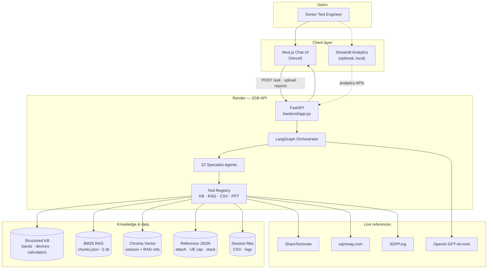
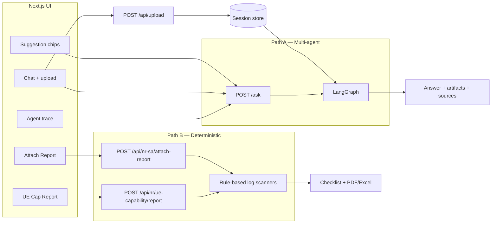
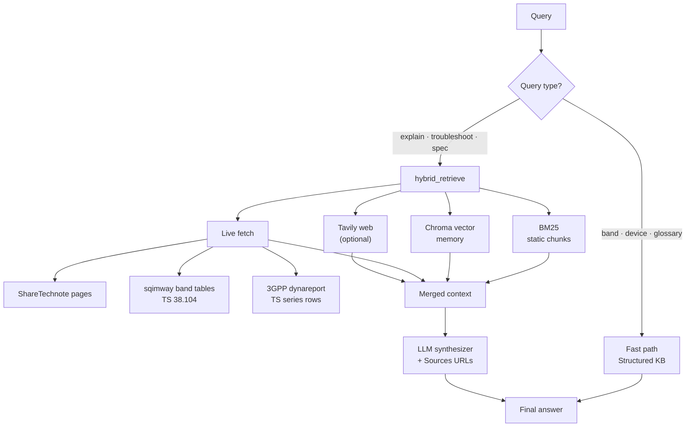
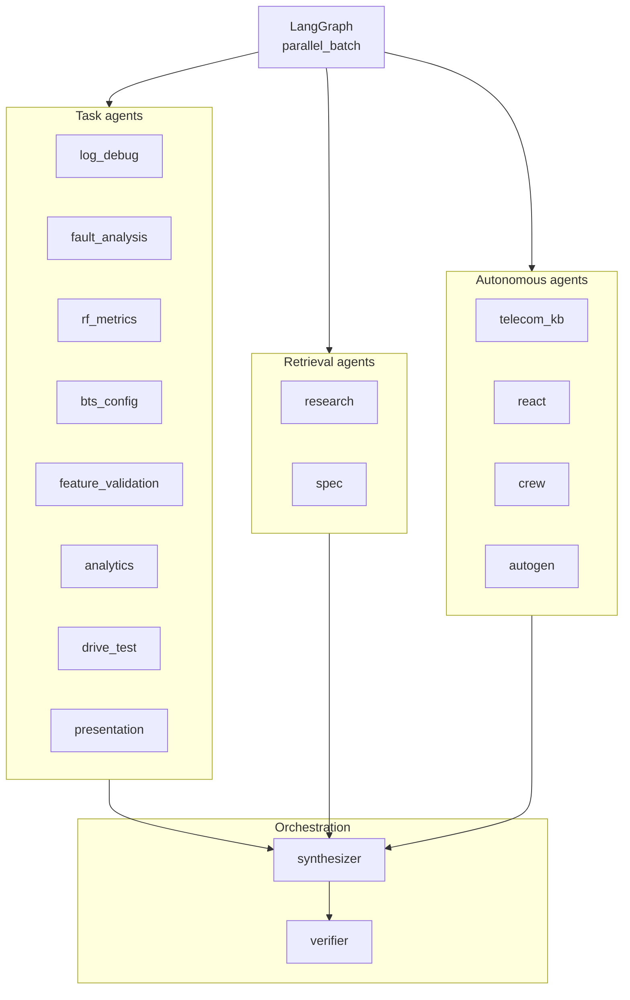
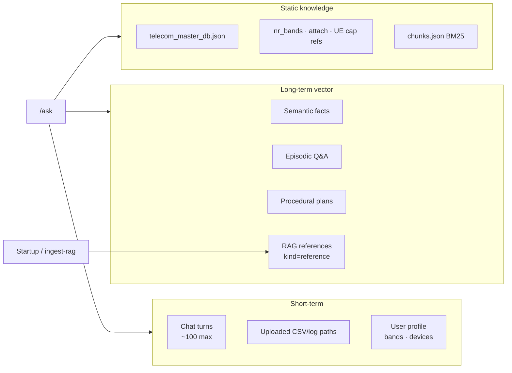

# TelecomGPT Architecture

Domain-specific multi-agent AI for **5G/LTE RF & Test Engineering**: Adaptive RAG + LangGraph + FastAPI + Next.js.

See also: **[ORCHESTRATION.md](./ORCHESTRATION.md)** (guardrails, integrations, env vars) · **[LEARNING_SYLLABUS.md](./LEARNING_SYLLABUS.md)** (12-week RAN → AI study guide) · **Agent deck:** `python backend/scripts/generate_agent_architecture_ppt.py`

---

## 1. System overview (deployment)



| Layer | Where | Role |
| --- | --- | --- |
| **UI (primary)** | Vercel | Chat, suggestion chips, agent trace, attach/UE-cap reports |
| **UI (analytics)** | `streamlit run analytics/app.py` | CSV/log charts — not the main chat path |
| **API + brain** | Render 2GB | FastAPI wraps LangGraph |
| **LLM** | OpenAI (prod) / Ollama (local) | Synthesis in `synthesizer` agent |

**Production URLs:** API `https://telecomgpt.onrender.com` · UI `https://telecomgpt.vercel.app`

---

## 2. Request flow — two paths



| Path | Use when | Trust model |
| --- | --- | --- |
| **A — `/ask`** | Explain, troubleshoot, KPI analysis, open questions | RAG + LLM + sources |
| **B — report APIs** | Attach / UE capability checklist scoring | Rule-based, auditable, PDF/Excel |

---

## 3. LangGraph orchestrator pipeline


**Module:** `backend/telecom_ai/orchestrator.py`

---

## 4. Adaptive hybrid RAG



**Module:** `backend/rag/hybrid_retrieve.py` · **Live fetch:** `backend/rag/live_fetch.py`

| Retrieval layer | Source |
| --- | --- |
| BM25 | `backend/data/rag/chunks.json` (~2,230 chunks) |
| Vector | ChromaDB `backend/data/memory/vector/` |
| Live ShareTechnote | Topic URL guess + top RAG cite refresh |
| Live sqimway | `nr_band.php` band rows (TS 38.104) |
| Live 3GPP | dynareport series pages + TS row extraction |
| Web | Tavily with domain bias (optional) |

---

## 5. Agent taxonomy



**Full map:** `GET /api/agents/taxonomy` · **Module:** `backend/telecom_ai/agents/taxonomy.py`

### Roles & responsibilities

#### Infrastructure nodes (LangGraph)

| Node | Responsibility |
| --- | --- |
| `load_memory` | Assemble session + semantic/episodic/procedural context |
| `guardrails_pre/post` | Input/output filtering, PII redaction |
| `plan` | Keyword (+ optional LLM) agent routing |
| `confidence_gate` | Clarification on vague low-confidence queries |
| `parallel_batch` | Run up to 8 agents concurrently |
| `save_memory` | Persist Q&A and successful plans |

#### Task agents (Test Engineer)

| Agent | Responsibility |
| --- | --- |
| `log_debug` | Parse UE logs, RRC/NAS scan, attach/UE-cap hints, protocol stack scan |
| `fault_analysis` | Symptom → cause → checks from fault catalog |
| `rf_metrics` | Drive-test CSV KPI grading, RF handbook hints |
| `bts_config` | gNB parameter scan vs 3GPP limits |
| `feature_validation` | 3GPP feature test templates + pass criteria |
| `drive_test` | SLA rules, GPS RF maps |
| `analytics` | Kaggle CSV, Plotly chart artifacts |
| `presentation` | PowerPoint report generation |
| `comparison` | Device/technology comparison |
| `compliance` | FCC regulatory checks |
| `deploy` / `eval` | Health status, KB smoke tests |

#### Retrieval & autonomous agents

| Agent | Responsibility |
| --- | --- |
| `research` | Hybrid RAG + live fetch + memory recall |
| `spec` | 3GPP TS-focused retrieval with citations |
| `telecom_kb` | Multi-tool KB lookups (bands, devices, CA, calculators) |
| `react` | ReAct loop — LLM picks tools |
| `crew` / `autogen` | CrewAI / AutoGen under hybrid engine mode |

#### Orchestration agents

| Agent | Responsibility |
| --- | --- |
| `synthesizer` | Merge agent outputs + RAG + LLM; append Sources |
| `verifier` | Cross-check answer vs KB agent outputs |

---

## 6. Memory architecture



| Operation | Endpoint |
| --- | --- |
| Snapshot | `GET /api/memory/{session_id}` |
| Compact session → long-term | `POST /api/memory/{session_id}/refresh` |
| Rebuild BM25 chunks | `POST /api/rag/reindex` |
| Vector index (background) | `POST /api/memory/ingest-rag` |
| Poll vector ingest | `GET /api/memory/ingest-rag/status` |

---

## 7. Layer stack

```
┌─────────────────────────────────────────────────────────────┐
│  PRESENTATION    Next.js (chat)  │  Streamlit (analytics)    │
├─────────────────────────────────────────────────────────────┤
│  API GATEWAY     FastAPI — /ask, uploads, reports, RAG ops  │
├─────────────────────────────────────────────────────────────┤
│  ORCHESTRATION   LangGraph — plan, guardrails, parallel run │
├─────────────────────────────────────────────────────────────┤
│  AGENTS          Task │ Retrieval │ Autonomous │ Synth/Verify│
├─────────────────────────────────────────────────────────────┤
│  TOOLS           KB lookup · hybrid_search · CSV · log · PPT│
├─────────────────────────────────────────────────────────────┤
│  KNOWLEDGE       JSON KB │ BM25 │ Chroma │ Live ST/sqim/3GPP│
├─────────────────────────────────────────────────────────────┤
│  LLM             OpenAI (prod) │ Ollama (local dev)          │
└─────────────────────────────────────────────────────────────┘
```

---

## 8. Test Engineer tools (Path B)

| Feature | API |
| --- | --- |
| NR SA attach report | `POST /api/nr-sa/attach-report` (+ PDF/Excel export) |
| UE Capability report | `POST /api/nr/ue-capability/report` (+ PDF/Excel) |
| NR band catalog (91 bands) | `GET /api/bands/nr` |
| Protocol stack reference | `GET /api/nr/protocol-stack/reference` |
| Power class reference | `GET /api/nr/power-class/reference` |
| RF handbook | `GET /api/rf/handbook/reference` |

---

## 9. Key endpoints

| Endpoint | Purpose |
| --- | --- |
| `POST /ask` | Multi-agent chat (async job for slow queries) |
| `POST /api/upload` | Session CSV/log upload |
| `GET /api/agents/taxonomy` | Full agent map |
| `GET /api/rag/status` | Chunk count, live fetch flags |
| `POST /api/rag/reindex` | Re-crawl ShareTechnote seed URLs |
| `POST /api/memory/ingest-rag` | Background vector index |
| `GET /api/memory/ingest-rag/status` | Poll vector ingest |
| `GET /api/health` | Liveness + `low_memory`, `vector_enabled` |
| `GET /api/monitoring/runs` | Recent orchestrator metrics |

---

## 10. Production configuration (2GB Render)

| Variable | Value | Effect |
| --- | --- | --- |
| `TELECOMGPT_LOW_MEMORY` | `0` | Full parallelism (8 agents) |
| `TELECOMGPT_VECTOR` | `1` | Chroma hybrid retrieval |
| `TELECOMGPT_LIVE_FETCH` | `1` | Live ShareTechnote/sqimway/3GPP |
| `TELECOMGPT_AUTO_REINDEX` | `1` | Vector ingest on boot (background) |
| `TELECOMGPT_ENGINE` | `hybrid` | LangGraph + CrewAI/AutoGen spokes |

See `render.yaml` for the full blueprint.

---

## 11. Local setup

```bash
cd backend
pip install -r requirements.txt
uvicorn app:app --port 8000

cd ../frontend
npm install && npm run dev   # NEXT_PUBLIC_API_URL=http://localhost:8000

streamlit run analytics/app.py   # optional analytics UI
```

Generate architecture PowerPoint:

```bash
cd backend
pip install python-pptx
python scripts/generate_agent_architecture_ppt.py
# → backend/data/reports/TelecomGPT_AI_Agent_Architecture_YYYYMMDD.pptx
```

Optional Mem0: `pip install mem0ai` and `TELECOMGPT_MEMORY=mem0`.
