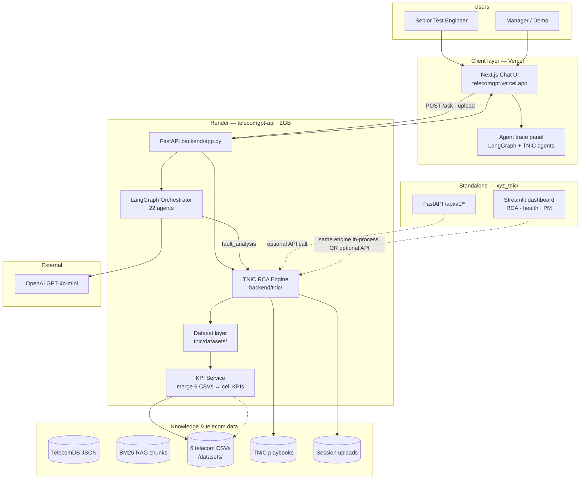
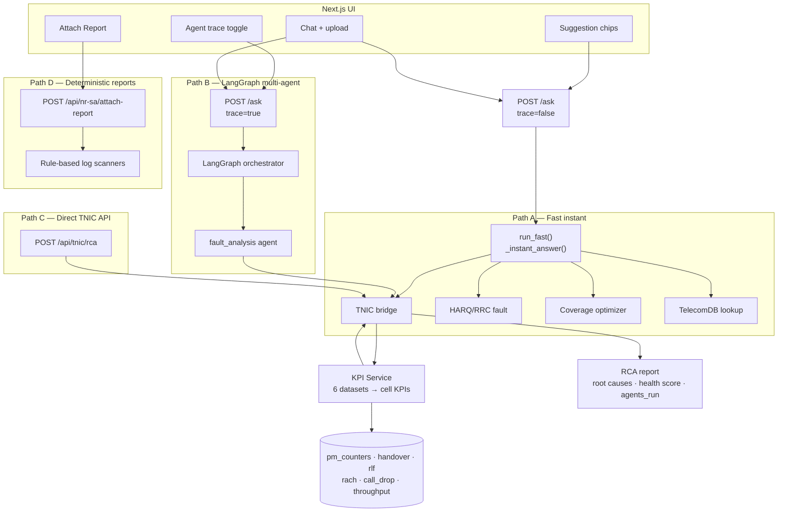
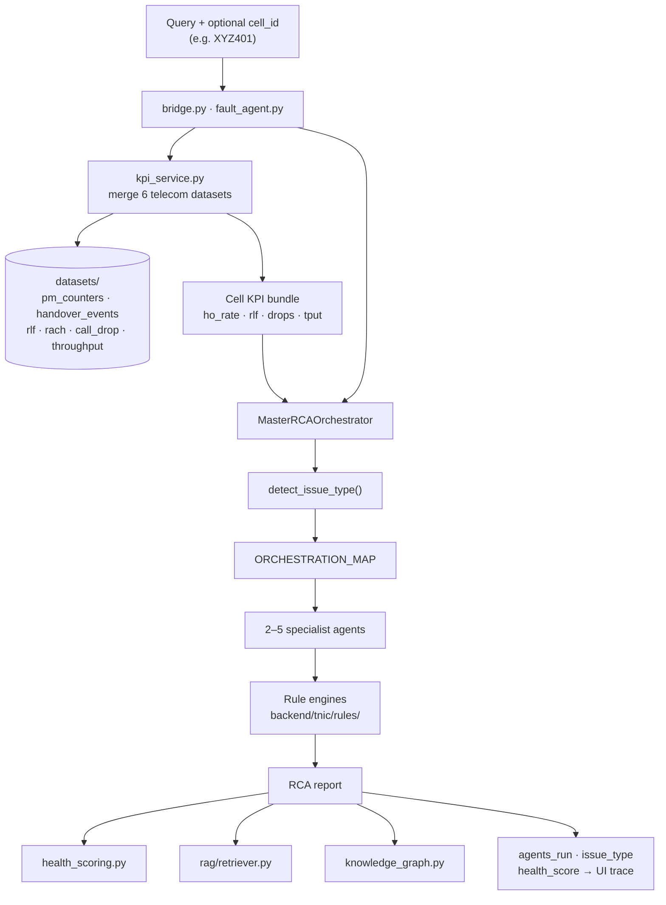
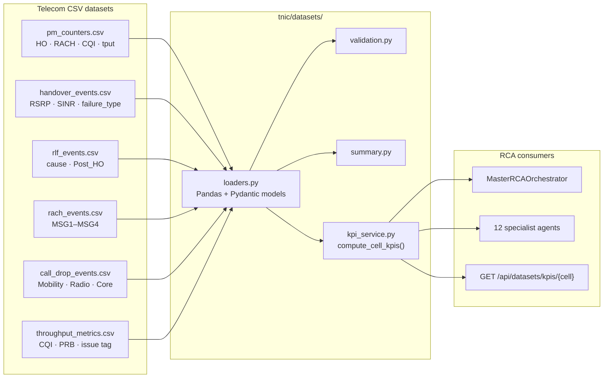
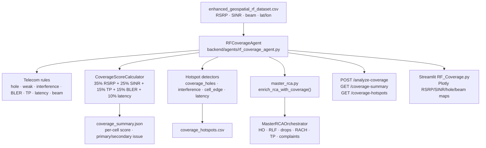
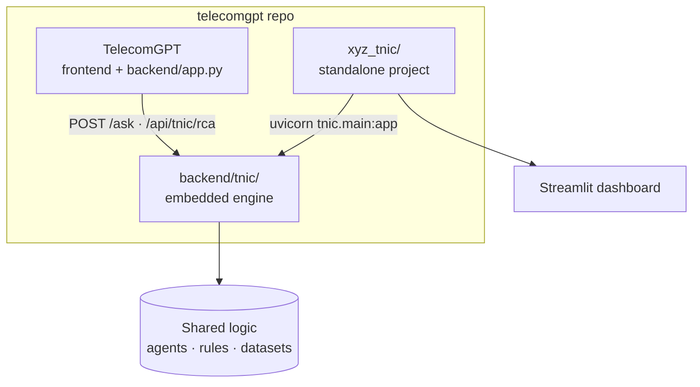
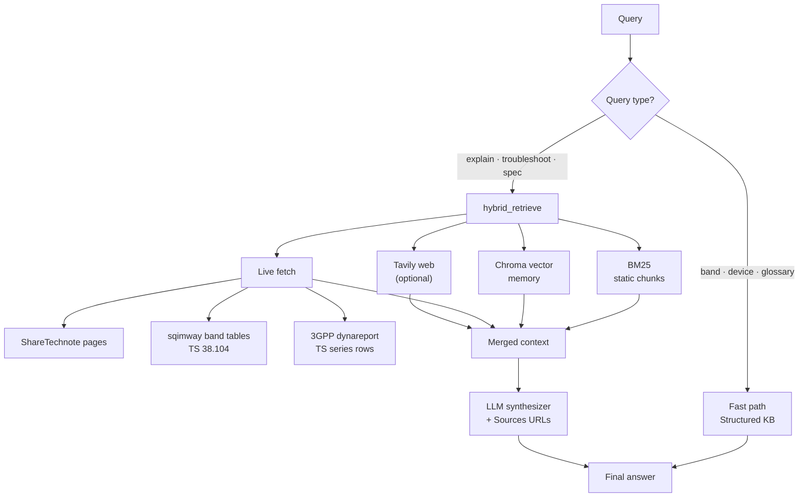
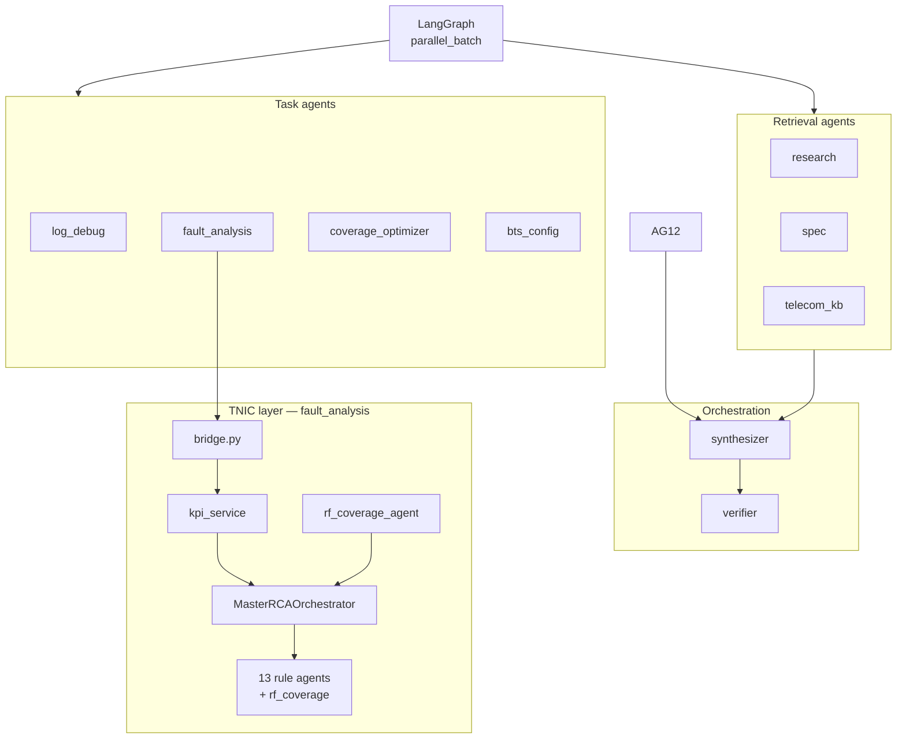
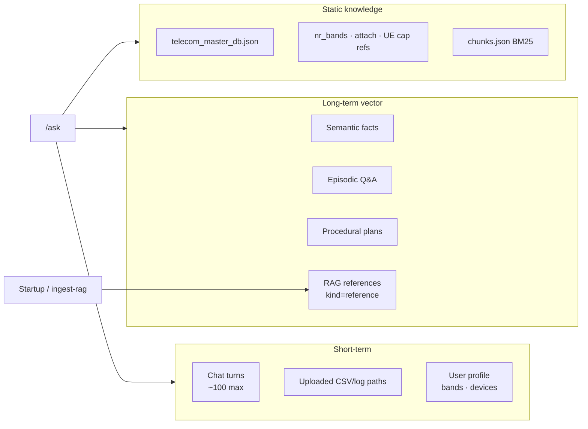
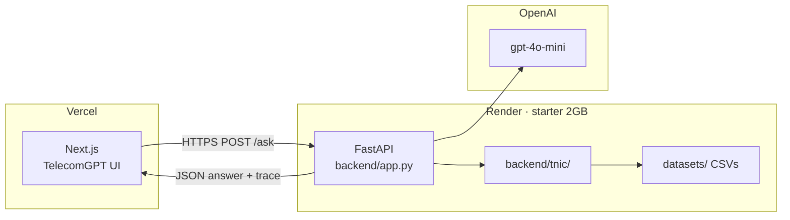

# TelecomGPT Architecture

Domain-specific multi-agent AI for **5G/LTE RF & Test Engineering**: Adaptive RAG + LangGraph + **TNIC RCA engine** + **telecom datasets** + FastAPI + Next.js.

**Deployed:** Vercel UI · Render API · TNIC RCA · dataset-driven KPIs · agent trace (PR #5) · standalone `xyz_tnic/` (PR #6)

See also: **[ORCHESTRATION.md](./ORCHESTRATION.md)** · **[RCA_AGENT_END_TO_END_HANDOVER.md](./RCA_AGENT_END_TO_END_HANDOVER.md)** · **[TNIC_DASHBOARD_DATA_FLOW.md](./TNIC_DASHBOARD_DATA_FLOW.md)** · **[xyz_tnic/README.md](../xyz_tnic/README.md)** · **[xyz_tnic/API.md](../xyz_tnic/API.md)** · **[DEMO_MANAGER.md](./DEMO_MANAGER.md)**

---

## 1. System overview (deployment)



> **Note on dotted lines:** `xyz_tnic/` (Streamlit dashboard) **does not always call Render**. In the **local demo**, Streamlit runs `xyz_tnic/tnic/` **in-process** on your machine and reads `datasets/` from disk. Dotted lines mean *same RCA logic / optional HTTP connection*, not *required dependency on Render*.

| Layer | Where | Role |
| --- | --- | --- |
| **UI (primary)** | Vercel | Chat, demo chips, agent trace (LangGraph plan + TNIC agents) |
| **UI (TNIC standalone)** | `xyz_tnic/dashboard/app.py` | Streamlit RCA dashboard — **local**, Docker, or Render |
| **UI (analytics)** | `analytics/app.py` | CSV/log charts — optional |
| **API + brain** | Render 2GB | FastAPI · LangGraph + TNIC + dataset APIs |
| **TNIC RCA** | `backend/tnic/` (Render) or `xyz_tnic/tnic/` (local dashboard) | 13 rule agents + Master RCA Orchestrator |
| **Dataset layer** | `tnic/datasets/` — CSVs on disk wherever the process runs | Loaders · validation · KPI merge |
| **LLM** | OpenAI | Synthesizer agent; optional TNIC narrative reports |

**Production URLs:** API `https://telecomgpt.onrender.com` · UI `https://telecomgpt.vercel.app`

---

## 1.1 Deployment vs local Streamlit demo (important)

The diagram in §1 shows **all product components** and **production deployment** on Render. That is **correct for the chat/API path**. The **Streamlit RCA dashboard** can also run **standalone on a demo machine** without calling Render. **Same codebase, two runtime modes.**

### Three runtime modes

| Mode | Who uses it | UI runs on | RCA + KPI + CSVs run on | Uses Render? |
| --- | --- | --- | --- | --- |
| **A — Production chat** | Engineers via Vercel | Vercel | **Render** (`backend/tnic/`, `TNIC_DATASETS_DIR=../datasets`) | **Yes** |
| **B — Local Streamlit demo** | Management / NOC demo | **Your machine** | **Your machine** (`xyz_tnic/tnic/`, `./datasets/` on disk) | **No** |
| **C — TNIC on Render** | Optional hosted TNIC | Render (Docker) | **Render** (`xyz_tnic/`, `/app/data/datasets`) | **Yes** (TNIC services) |

### Mode A — Production chat (diagram Render box)

```
User → Vercel (telecomgpt.vercel.app)
     → Render (telecomgpt.onrender.com)
     → backend/tnic/ ON RENDER
     → datasets/ bundled IN RENDER container
     → KPI service + agents ON RENDER
```

**Manager takeaway:** For **TelecomGPT chat**, Render **does** host the RCA engine, KPI service, and CSV datasets.

### Mode B — Local Streamlit demo (default for sidebar pages)

```
User → Browser (localhost:8502)
     → streamlit run xyz_tnic/dashboard/app.py ON YOUR MACHINE
     → xyz_tnic/tnic/ IN SAME PYTHON PROCESS
     → datasets/ ON YOUR DISK (repo clone)
     → KPI service + agents IN PROCESS — no HTTP to Render
```

**Start command:**

```bash
cd xyz_tnic
export TNIC_DATASETS_DIR=/path/to/repo/datasets   # optional; defaults to ./datasets
streamlit run dashboard/app.py --server.port 8502
```

**Pages that stay 100% local:** Handover, RLF, VoNR, Call Drops, RACH, Throughput, RCA Report, Assurance Hub, etc. They call `dashboard_utils.py` → `loaders.py` → `kpi_service.py` → agents/rules **in-process**.

**Optional Render use:** Upload page only — sidebar API URL can be set to `https://telecomgpt.onrender.com/api/v1`; if unreachable, **falls back to local Python**.

### Mode C — TNIC deployed on Render (`xyz_tnic/render.yaml`)

Separate Render services can host `xyz_tnic` API + Streamlit dashboard with datasets at `/app/data/datasets`. This is **optional**; not the same service as `telecomgpt-api` unless configured.

### Same brain, two copies in the repo

| Code copy | Used when |
| --- | --- |
| `backend/tnic/` | Render TelecomGPT API (`backend/app.py`) |
| `xyz_tnic/tnic/` | Streamlit dashboard (local or Docker) |

Both implement the same agents, rules, loaders, and KPI merge. **Data** is the same files under repo root `datasets/` — copied to whichever environment runs the process.

### Reconciliation table (answers “Render has all data” vs “runs on my machine”)

| Question | Chat / API on Render | Local Streamlit demo |
| --- | --- | --- |
| Where is RCA engine? | **Render** | **Your machine** |
| Where are CSVs? | **Render container** (bundled at deploy) | **Your disk** (`datasets/`) |
| Where is KPI service? | **Render** | **Your machine** |
| OpenAI required? | Often (LangGraph chat) | **No** for core RCA (optional narrative only) |
| Diagram §1 applies? | **Yes** | **Partially** — use Mode B above |

### What to tell management

> “The architecture diagram shows **production**: chat on Vercel talks to **Render**, and Render hosts RCA, KPIs, and datasets. Our **Streamlit dashboard demo** uses the **same logic and same CSV files** from the GitHub repo, but runs **locally on the demo laptop** — it does not need Render for Handover, RLF, or RCA Report. Same expert checklists; two ways to run them.”

**See also:** [RCA_MANAGER_EXPLAINER.md](./RCA_MANAGER_EXPLAINER.md) §8 · [TNIC_DASHBOARD_DATA_FLOW.md](./TNIC_DASHBOARD_DATA_FLOW.md)

---

## 2. Request flow — four paths



| Path | Trigger | Module | Trust model |
| --- | --- | --- | --- |
| **A — Fast instant** | Trace OFF + RCA/fault/glossary query | `telecom_ai/core.py` → `tnic/bridge.py` | Rule-based TNIC + structured KB — no LangGraph |
| **B — LangGraph** | Trace ON or complex/slow query | `telecom_ai/orchestrator.py` → `fault_analysis` → TNIC | Multi-agent plan + optional LLM synthesizer |
| **C — TNIC API** | `POST /api/tnic/rca` | `backend/tnic/bridge.py` | Direct RCA bypassing LangGraph |
| **D — Report APIs** | Attach report upload | `analytics/log_attach_check.py` | Rule-based, auditable checklist |

**RCA demo chips** (`Root cause analysis call drop`, `Root cause low throughput`) use Path A when trace is off, Path B when trace is on. Upload a PM CSV first for richer KPI-driven rules.

---

## 3. TNIC — Network Intelligence Copilot (RCA engine)

TNIC is a **rule-based multi-agent RCA platform** embedded in TelecomGPT at `backend/tnic/`. A standalone copy lives at `xyz_tnic/` (Docker, full REST API, Streamlit dashboard, tests).

### 3.1 TNIC execution flow



### 3.2 Specialist agents (13 + orchestrator)

| Registry key | Agent | Rule module / data source |
| --- | --- | --- |
| `handover` | `ho_agent` | `rules/ho_rules.py` |
| `rlf` | `rlf_agent` | `rules/rlf_rules.py` |
| `call_drop` | `call_drop_agent` | `rules/call_drop_rules.py` |
| `throughput` | `throughput_agent` | `rules/throughput_rules.py` |
| `rach` | `rach_agent` | `rules/rach_rules.py` |
| `beamforming` | `beamforming_agent` | `rules/beamforming_rules.py` |
| `latency` | `latency_agent` | `rules/latency_rules.py` |
| `rf_coverage` | `rf_coverage_agent` | `backend/agents/rf_coverage_agent.py` + geospatial CSV |
| `pm` | `pm_agent` | `services/pm_ingestion.py` |
| `transport` | `transport_agent` | inline KPI rules |
| `core` | `core_agent` | inline KPI rules |
| `complaint` | `complaint_agent` | query triage |
| — | **MasterRCAOrchestrator** | `orchestrator/rca_orchestrator.py` |
| — | **Coverage correlation** | `orchestrator/master_rca.py` |

**Module:** `backend/tnic/agents/specialists.py` → `AGENT_REGISTRY`

### 3.3 Orchestration map (agents per issue)

| Issue type | Agents invoked |
| --- | --- |
| `call_drop` | call_drop, rlf, handover, beamforming, core |
| `throughput` | throughput, beamforming, transport, pm |
| `handover` | handover, rlf, pm |
| `rlf` | rlf, handover, call_drop, pm |
| `rach` | rach, beamforming, pm |
| `latency` | latency, transport, core |
| `beamforming` | beamforming, throughput, call_drop |
| `transport` | transport, latency, throughput |
| `core` | core, latency, call_drop |
| `complaint` | complaint, handover, throughput, call_drop, rf_coverage |
| `rf_coverage` | rf_coverage, rlf, handover, call_drop, rach, throughput, beamforming, complaint |
| `coverage` | rf_coverage, rlf, handover, call_drop, rach, throughput, beamforming |

### 3.3.1 Coverage correlation (Master RCA)

When RF coverage is detected, `orchestrator/master_rca.py` injects cross-domain findings:

| Primary coverage issue | Correlated impacts |
| --- | --- |
| Coverage Hole / Weak Coverage | HO Failure, RLF, Call Drops, RACH Failure, Throughput Degradation, Customer Complaints |
| Beam Coverage Gap | Beam Congestion, Throughput Degradation, HO Failure |

**Module:** `enrich_rca_with_coverage()` — called from `MasterRCAOrchestrator` when query mentions coverage or `cell_id` is present.

### 3.4 TNIC integration points

| Entry | File | When used |
| --- | --- | --- |
| Fast-kb path | `backend/tnic/bridge.py` → `run_tnic_rca()` | Trace OFF + RCA query → instant answer |
| LangGraph agent | `backend/tnic/fault_agent.py` | `fault_analysis` in parallel batch |
| Direct API | `POST /api/tnic/rca` in `backend/app.py` | External/script access |
| Test engineer dispatch | `telecom_ai/agents/test_engineer.py` | Orchestrator agent routing |

**Exception:** `Fault analysis RRC fail` uses `analytics/harq_rrc_fault.py` only — does **not** invoke TNIC agents.

### 3.5 TNIC services

| Service | Module | Role |
| --- | --- | --- |
| Health score | `services/health_scoring.py` | 8-dimension weighted score, grade A–D |
| PM ingestion | `services/pm_ingestion.py` | CSV counter ingest + KPI validation |
| OpenAI report | `services/report_generator.py` | Narrative RCA (template fallback) |
| RAG | `rag/retriever.py` | ChromaDB or BM25 fallback on JSON playbooks |
| Knowledge graph | `orchestrator/knowledge_graph.py` | complaint → KPI → root cause → action |
| **Dataset loaders** | `datasets/loaders.py` | Pandas loaders for 6 telecom CSVs |
| **KPI calculation** | `datasets/kpi_service.py` | Merge datasets → cell KPIs for all agents |
| **Dataset validation** | `datasets/validation.py` | CQI range, counter consistency checks |
| **Dataset summary** | `datasets/summary.py` | Row counts, cells, category breakdowns |

### 3.8 Telecom datasets pipeline

Six bundled CSV datasets under `/datasets/` (also `backend/data/datasets/`):



| Dataset | Key derived KPIs |
| --- | --- |
| `pm_counters.csv` | `ho_success_rate`, `rach_success_rate`, `throughput_mbps`, `cqi` |
| `handover_events.csv` | `ho_prep_fail_rate`, `ho_too_late_rate`, `ss_rsrp`, `ss_sinr` |
| `rlf_events.csv` | `rlf_rate`, cause breakdown (Coverage, Post_HO, Interference) |
| `rach_events.csv` | `rach_success_rate`, MSG1–MSG4 fail rates |
| `call_drop_events.csv` | `call_drop_rate`, drop type breakdown |
| `throughput_metrics.csv` | `throughput_mbps`, `prb_utilization`, issue tags |

**Override path:** set env `TNIC_DATASETS_DIR` or upload session CSV via `POST /api/upload`.

### 3.9 RF Coverage Agent — geospatial drive-test layer

Seventh domain dataset: **`enhanced_geospatial_rf_dataset.csv`** (~2000 rows, 3-mile Dallas SITE01 drive test).



| Telecom rule | Threshold | Issue code |
| --- | --- | --- |
| Coverage hole | RSRP ≤ -115 dBm | `COVERAGE_HOLE` |
| Weak coverage | RSRP ≤ -105 dBm | `WEAK_COVERAGE` |
| Interference | SINR ≤ -5 dB | `INTERFERENCE` |
| High BLER | BLER DL > 10% | `HIGH_BLER` |
| Low throughput | DL TP < 100 Mbps | `LOW_THROUGHPUT` |
| Latency hotspot | latency > 80 ms | `LATENCY_HOTSPOT` |
| Beam gap | beam_health < 35 or PRB > 75% | `BEAM_COVERAGE_GAP` |

**Demo cell XYZ401:** Primary = Coverage Deficiency · Secondary = Beam Congestion · Score = 52 · Confidence = 94%.

**Key modules:**

| Module | Role |
| --- | --- |
| `backend/agents/rf_coverage_agent.py` | Core agent — rules, scoring, hotspots, JSON/CSV artifacts |
| `backend/tnic/orchestrator/master_rca.py` | Coverage → cross-domain RCA correlation |
| `backend/tnic/api/routes/coverage.py` | REST endpoints |
| `xyz_tnic/dashboard/pages/RF_Coverage.py` | Plotly geospatial dashboard |
| `backend/tnic/services/coverage_optimizer.py` | 3-mile drive-route optimizer (Google Maps page) |

### 3.6 Two `specialists.py` files (do not confuse)

| File | Purpose |
| --- | --- |
| `backend/tnic/agents/specialists.py` | TNIC RCA rule agents (HO, RLF, throughput, …) |
| `backend/telecom_ai/agents/specialists.py` | LangGraph chat agents (telecom_kb, research, synthesizer) |

### 3.7 Standalone `xyz_tnic/` project

The blueprint standalone project at `xyz_tnic/` mirrors `backend/tnic/` with additional deliverables:

- Full REST API (`/api/v1/analyze/rca`, `/health-score/cell`, `/pm/ingest`, `/incidents`, `/datasets/*`)
- Streamlit dashboard (`xyz_tnic/dashboard/app.py`)
- Docker + docker-compose + Render config
- Sample datasets (`pm_counters.csv`, `incidents.csv`, 6 telecom CSVs)
- 52 unit tests · Chroma ingestion script · API.md



See **[xyz_tnic/README.md](../xyz_tnic/README.md)** and **[xyz_tnic/API.md](../xyz_tnic/API.md)**.

---

## 4. LangGraph orchestrator pipeline


**Module:** `backend/telecom_ai/orchestrator.py`

---

## 5. Adaptive hybrid RAG



**Module:** `backend/rag/hybrid_retrieve.py` · **Live fetch:** `backend/rag/live_fetch.py`

| Retrieval layer | Source |
| --- | --- |
| BM25 | `backend/data/rag/chunks.json` (~2,230 chunks) |
| Vector | ChromaDB `backend/data/memory/vector/` |
| Live ShareTechnote | Topic URL guess + top RAG cite refresh |
| Live sqimway | `nr_band.php` band rows (TS 38.104) |
| Live 3GPP | dynareport series pages + TS row extraction |
| Web | Tavily with domain bias (optional) |

---

## 6. Agent taxonomy



**Full map:** `GET /api/agents/taxonomy` · **Module:** `backend/telecom_ai/agents/taxonomy.py`

### Roles & responsibilities

#### Infrastructure nodes (LangGraph)

| Node | Responsibility |
| --- | --- |
| `load_memory` | Assemble session + semantic/episodic/procedural context |
| `guardrails_pre/post` | Input/output filtering, PII redaction |
| `plan` | Keyword (+ optional LLM) agent routing |
| `confidence_gate` | Clarification on vague low-confidence queries |
| `parallel_batch` | Run up to 8 agents concurrently |
| `save_memory` | Persist Q&A and successful plans |

#### Task agents (Test Engineer)

| Agent | Responsibility |
| --- | --- |
| `log_debug` | Parse UE logs, RRC/NAS scan, attach/UE-cap hints, protocol stack scan |
| `fault_analysis` | TNIC RCA — HO/RLF/call drop/throughput/RACH/beam/latency via `backend/tnic/`; RRC/HARQ uses fault catalog |
| `rf_metrics` | Redirects to TNIC RCA or coverage optimizer (disabled heavy KPI path in 2GB demo) |
| `bts_config` | gNB parameter scan vs 3GPP limits |
| `feature_validation` | 3GPP feature test templates + pass criteria |
| `drive_test` | SLA rules, GPS RF maps |
| `analytics` | Kaggle CSV, Plotly chart artifacts |
| `presentation` | PowerPoint report generation |
| `comparison` | Device/technology comparison |
| `compliance` | FCC regulatory checks |
| `deploy` / `eval` | Health status, KB smoke tests |

#### Retrieval & autonomous agents

| Agent | Responsibility |
| --- | --- |
| `research` | Hybrid RAG + live fetch + memory recall |
| `spec` | 3GPP TS-focused retrieval with citations |
| `telecom_kb` | Multi-tool KB lookups (bands, devices, CA, calculators) |
| `react` | ReAct loop — LLM picks tools |
| `crew` / `autogen` | CrewAI / AutoGen under hybrid engine mode |

#### Orchestration agents

| Agent | Responsibility |
| --- | --- |
| `synthesizer` | Merge agent outputs + RAG + LLM; append Sources |
| `verifier` | Cross-check answer vs KB agent outputs |

---

## 7. Memory architecture



| Operation | Endpoint |
| --- | --- |
| Snapshot | `GET /api/memory/{session_id}` |
| Compact session → long-term | `POST /api/memory/{session_id}/refresh` |
| Rebuild BM25 chunks | `POST /api/rag/reindex` |
| Vector index (background) | `POST /api/memory/ingest-rag` |
| Poll vector ingest | `GET /api/memory/ingest-rag/status` |

---

## 8. Layer stack

```
┌─────────────────────────────────────────────────────────────┐
│  PRESENTATION    Next.js (Vercel) │ Streamlit (xyz_tnic)     │
├─────────────────────────────────────────────────────────────┤
│  API GATEWAY     /ask · /api/tnic/rca · /api/datasets/*     │
├─────────────────────────────────────────────────────────────┤
│  ORCHESTRATION   LangGraph — plan · guardrails · parallel   │
├─────────────────────────────────────────────────────────────┤
│  TNIC RCA        13 agents + MasterRCAOrchestrator + master_rca │
├─────────────────────────────────────────────────────────────┤
│  DATASET LAYER   loaders · validation · KPI merge (6 CSVs)  │
├─────────────────────────────────────────────────────────────┤
│  AGENTS          Task │ Retrieval │ Synthesizer │ Verifier  │
├─────────────────────────────────────────────────────────────┤
│  TOOLS           KB · hybrid RAG · CSV · log · attach report│
├─────────────────────────────────────────────────────────────┤
│  KNOWLEDGE       TelecomDB │ BM25 │ TNIC playbooks │ datasets│
├─────────────────────────────────────────────────────────────┤
│  LLM             OpenAI GPT-4o-mini                          │
└─────────────────────────────────────────────────────────────┘
```

---

## 9. Test Engineer tools (Path D)

| Feature | API |
| --- | --- |
| NR SA attach report | `POST /api/nr-sa/attach-report` (+ PDF/Excel export) |
| UE Capability report | `POST /api/nr/ue-capability/report` (+ PDF/Excel) |
| NR band catalog (91 bands) | `GET /api/bands/nr` |
| Protocol stack reference | `GET /api/nr/protocol-stack/reference` |
| Power class reference | `GET /api/nr/power-class/reference` |
| RF handbook | `GET /api/rf/handbook/reference` |

---

## 10. Key endpoints

| Endpoint | Purpose |
| --- | --- |
| `POST /ask` | Multi-agent chat (fast instant or LangGraph; returns `tnic_agents_run` when trace ON) |
| `POST /api/tnic/rca` | Direct TNIC RCA — bypasses LangGraph |
| `GET /api/datasets/summary` | Summaries for all 6 telecom CSV datasets |
| `GET /api/datasets/kpis/{cell_id}` | Merged cell KPIs from all datasets |
| `GET /api/datasets/validate-all` | Validate all dataset files |
| `POST /api/upload` | Session CSV/log upload (overrides dataset KPIs) |
| `GET /api/rf/coverage-optimizer` | Coverage optimizer with map artifacts |
| `POST /api/v1/analyze-coverage` | RF Coverage Agent — per-cell geospatial analysis (TNIC) |
| `GET /api/v1/coverage-summary` | Per-cell or full `coverage_summary.json` (TNIC) |
| `GET /api/v1/coverage-hotspots` | Geospatial hotspot records (TNIC) |
| `GET /api/fault/rrc-harq` | RRC/HARQ fault catalog (non-TNIC path) |
| `GET /api/health` | Liveness + memory/vector flags |

**Standalone TNIC API** (`xyz_tnic/`): `/api/v1/analyze/rca`, `/datasets/*`, `/incidents` — see [xyz_tnic/API.md](../xyz_tnic/API.md).

---

## 11. Production configuration (2GB Render demo)

Current `render.yaml` settings for the lean manager demo:

| Variable | Value | Effect |
| --- | --- | --- |
| `TELECOMGPT_LOW_MEMORY` | `1` | Reduced memory footprint |
| `TELECOMGPT_VECTOR` | `0` | Chroma off — BM25/JSON fallback for RAG and TNIC playbooks |
| `TELECOMGPT_LIVE_FETCH` | `0` | No live ShareTechnote/sqimway/3GPP at runtime |
| `TELECOMGPT_AUTO_REINDEX` | `0` | No vector ingest on boot |
| `TELECOMGPT_LLM_PLAN` | `0` | Keyword-based agent plan (no LLM planning) |
| `TELECOMGPT_MAX_PARALLEL_AGENTS` | `4` | Limits LangGraph concurrency |
| `TELECOMGPT_FAST_ASK` | `1` | Fast instant path for typical Q&A |
| `TELECOMGPT_ENGINE` | `langgraph` | LangGraph orchestrator (CrewAI/AutoGen optional) |

For full-capacity deployment, set `TELECOMGPT_VECTOR=1`, `TELECOMGPT_LIVE_FETCH=1`, `TELECOMGPT_LOW_MEMORY=0`.

See `render.yaml` for the full blueprint.

---

## 12. Local setup

```bash
# TelecomGPT API
cd backend
pip install -r requirements.txt
uvicorn app:app --port 8000

# Frontend
cd ../frontend
npm install && npm run dev   # NEXT_PUBLIC_API_URL=http://localhost:8000

# Optional analytics UI
streamlit run analytics/app.py

# Standalone TNIC (full RCA API + dashboard)
cd ../xyz_tnic
pip install -r requirements.txt
cp .env.example .env
python scripts/ingest_chroma.py
uvicorn tnic.main:app --port 8001
streamlit run dashboard/app.py   # separate terminal
```

Generate architecture PowerPoint:

```bash
cd backend
pip install python-pptx
python scripts/generate_agent_architecture_ppt.py
# → backend/data/reports/TelecomGPT_AI_Agent_Architecture_YYYYMMDD.pptx
```

Optional Mem0: `pip install mem0ai` and `TELECOMGPT_MEMORY=mem0`.

---

## 13. Deployment topology (production)



| PR | Feature | Status |
| --- | --- | --- |
| #4 | TNIC unified into TelecomGPT | Deployed |
| #5 | TNIC agent trace + UI branding cleanup | Deployed |
| #6 | Standalone `xyz_tnic/` + telecom datasets | Deployed |
| #20 | RF Coverage Agent — geospatial rules, APIs, Plotly dashboard, Master RCA correlation | Deployed |

**Repo layout after merge:**

```
telecomgpt/
├── frontend/          → Vercel
├── backend/           → Render (app.py)
│   ├── agents/        → RF Coverage Agent (geospatial rules)
│   └── tnic/          → RCA engine + datasets + master_rca
├── datasets/          → 6 telecom CSVs + enhanced_geospatial_rf_dataset.csv
└── xyz_tnic/          → standalone TNIC project
```
