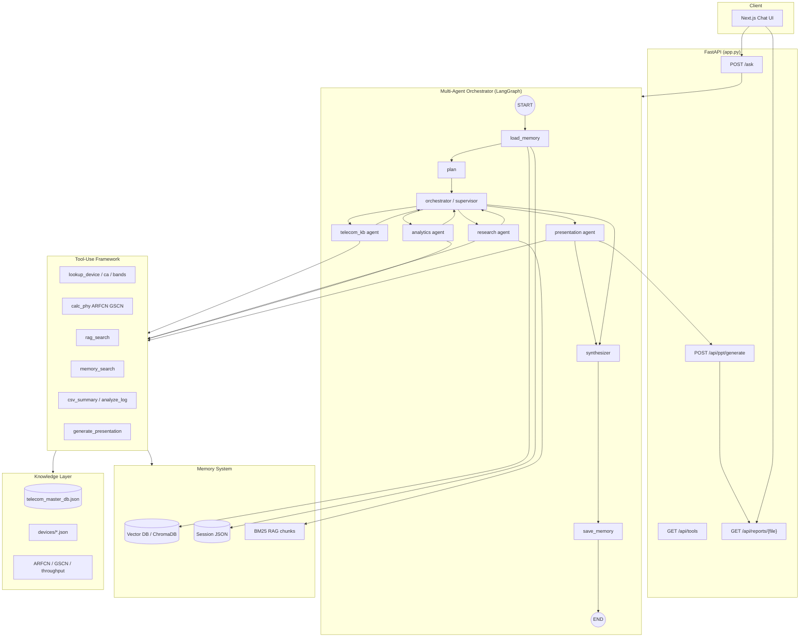

# TelecomGPT Next-Gen Architecture

Multi-agent orchestrator for cellular/RF engineering with autonomous planning, tool use, vector memory, and PowerPoint report generation.

## Architecture Diagram



## Agent Roles

| Agent | Role | Tools |
| --- | --- | --- |
| **Orchestrator** | Plans steps, dispatches specialists | — |
| **telecom_kb** | Bands, devices, CA/EN-DC, PHY math | `lookup_*`, `calc_phy` |
| **research** | RAG + vector memory retrieval | `rag_search`, `memory_search` |
| **analytics** | CSV/Kaggle/log analysis | `csv_summary`, `detect_rf_columns`, `list_kaggle_csvs` |
| **presentation** | PowerPoint report generation | `generate_presentation` |
| **synthesizer** | Merges outputs → final answer | LLM + sources |

## Planning Flow

1. **load_memory** — recall session history + vector memory
2. **plan** — rule-based planner (+ optional LLM refinement)
3. **orchestrator** — dispatch agents in plan order
4. **specialists** — run tools, collect outputs
5. **synthesizer** — LLM merges agent outputs with KB/RAG
6. **save_memory** — persist turn to session + vector store

## PowerPoint Reports

Ask in chat:

- *"Generate a PowerPoint report on 5G network slicing"*
- *"Create a PPT presentation comparing LTE vs 5G"*

Or call directly:

```bash
curl -X POST http://localhost:8000/api/ppt/generate \
  -H "Content-Type: application/json" \
  -d '{"topic":"5G NR Overview","content":"# Intro\n...\n# Bands\n..."}'
```

Download: `GET /api/reports/{filename}.pptx`

## Configuration

| Env var | Default | Purpose |
| --- | --- | --- |
| `TELECOMGPT_MODE` | `orchestrator` | Set `legacy` for old keyword router |
| `TELECOMGPT_LLM_PLAN` | `1` | LLM plan refinement |
| `TELECOMGPT_LLM` | `auto` | `openai` / `ollama` / `auto` |
| `OPENAI_API_KEY` | — | OpenAI for synthesis |
| `RAG_TOP_K` | `5` | RAG retrieval count |

## Setup Vector Memory

```bash
cd backend
pip install chromadb python-pptx
python -c "from memory.vector_store import VectorMemory; from rag.store import load_chunks; VectorMemory().ingest_rag_chunks(load_chunks())"
# or: POST /api/memory/ingest-rag
```

## File Map

```
backend/telecom_ai/
  orchestrator.py      Multi-agent LangGraph
  planning.py          Autonomous planner
  tools.py             Tool registry
  agents/specialists.py  Specialist agent logic
  core.py              TelecomAI facade
backend/memory/
  vector_store.py      ChromaDB + fallback index
  session_memory.py    Per-session JSON history
backend/ppt/
  generator.py         python-pptx report builder
```
