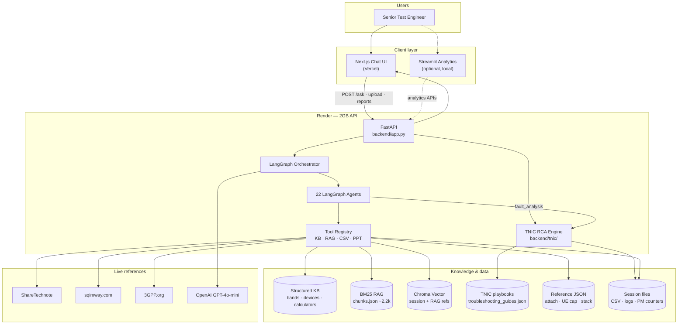
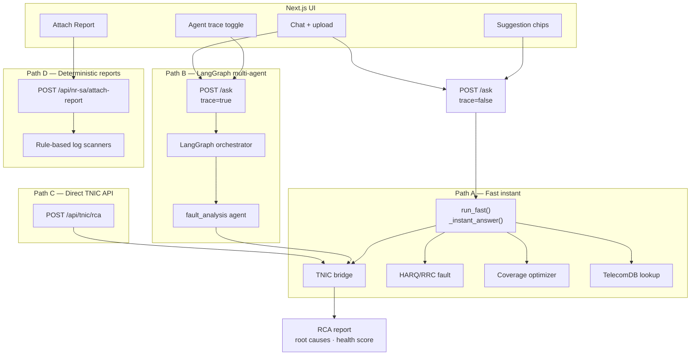
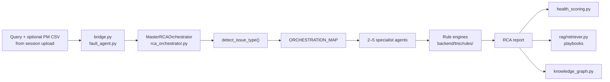
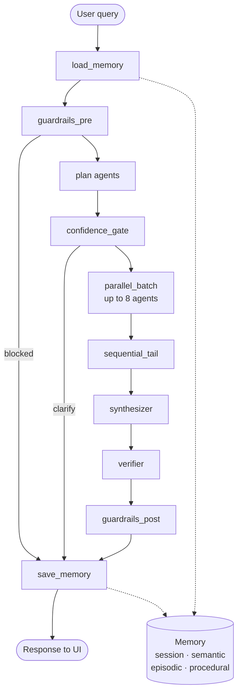
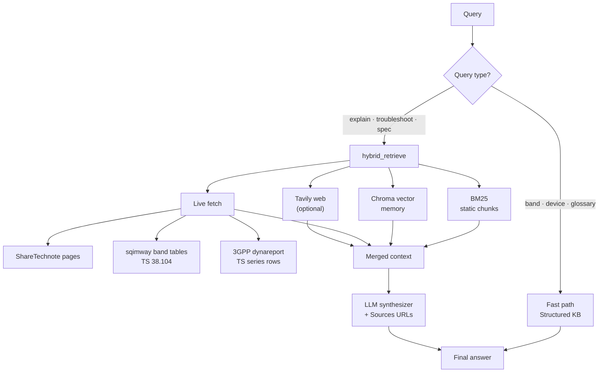
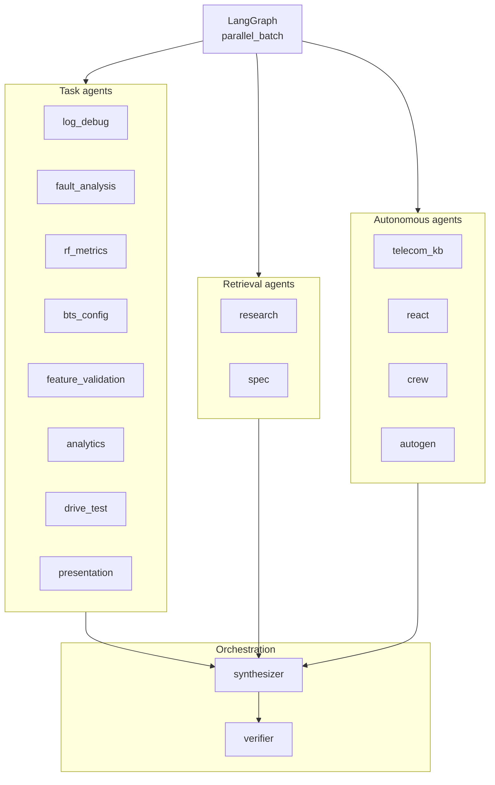
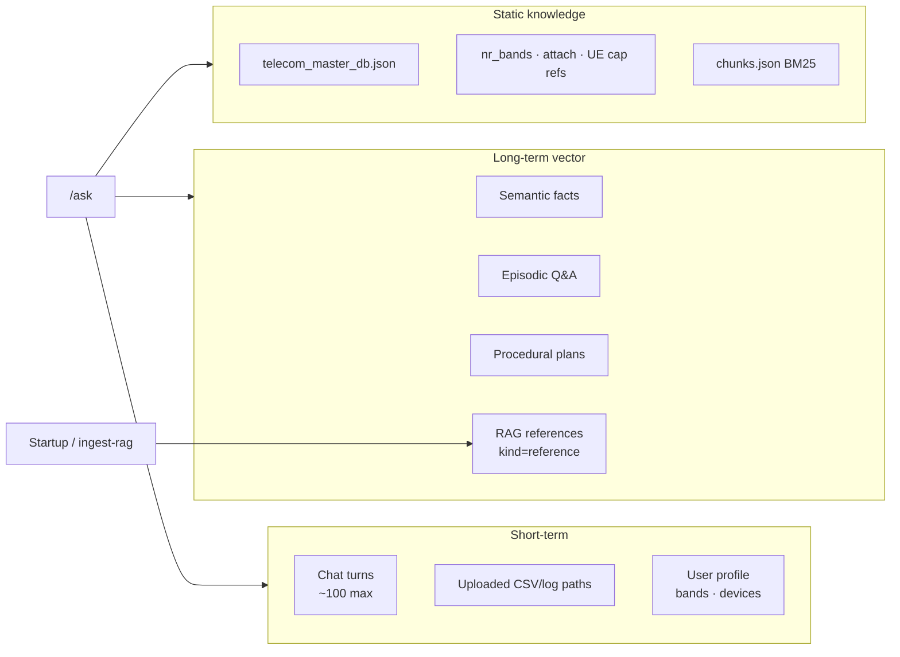

# TelecomGPT Architecture

Domain-specific multi-agent AI for **5G/LTE RF & Test Engineering**: Adaptive RAG + LangGraph + **TNIC RCA engine** + FastAPI + Next.js.

See also: **[ORCHESTRATION.md](./ORCHESTRATION.md)** · **[xyz_tnic/README.md](../xyz_tnic/README.md)** (standalone TNIC project) · **[LEARNING_SYLLABUS.md](./LEARNING_SYLLABUS.md)** · **[DEMO_MANAGER.md](./DEMO_MANAGER.md)** · **Agent deck:** `python backend/scripts/generate_agent_architecture_ppt.py`

---

## 1. System overview (deployment)



| Layer | Where | Role |
| --- | --- | --- |
| **UI (primary)** | Vercel | Chat, suggestion chips, agent trace, attach reports |
| **UI (analytics)** | `streamlit run analytics/app.py` | CSV/log charts — not the main chat path |
| **UI (TNIC standalone)** | `xyz_tnic/dashboard/app.py` | Streamlit RCA dashboard — local/Docker only |
| **API + brain** | Render 2GB | FastAPI wraps LangGraph + TNIC |
| **TNIC RCA** | `backend/tnic/` | 12 rule-based agents + Master RCA Orchestrator |
| **LLM** | OpenAI (prod) / Ollama (local) | Synthesis in `synthesizer` agent; optional TNIC narrative reports |

**Production URLs:** API `https://telecomgpt.onrender.com` · UI `https://telecomgpt.vercel.app`

---

## 2. Request flow — four paths



| Path | Trigger | Module | Trust model |
| --- | --- | --- | --- |
| **A — Fast instant** | Trace OFF + RCA/fault/glossary query | `telecom_ai/core.py` → `tnic/bridge.py` | Rule-based TNIC + structured KB — no LangGraph |
| **B — LangGraph** | Trace ON or complex/slow query | `telecom_ai/orchestrator.py` → `fault_analysis` → TNIC | Multi-agent plan + optional LLM synthesizer |
| **C — TNIC API** | `POST /api/tnic/rca` | `backend/tnic/bridge.py` | Direct RCA bypassing LangGraph |
| **D — Report APIs** | Attach report upload | `analytics/log_attach_check.py` | Rule-based, auditable checklist |

**RCA demo chips** (`Root cause analysis call drop`, `Root cause low throughput`) use Path A when trace is off, Path B when trace is on. Upload a PM CSV first for richer KPI-driven rules.

---

## 3. TNIC — Network Intelligence Copilot (RCA engine)

TNIC is a **rule-based multi-agent RCA platform** embedded in TelecomGPT at `backend/tnic/`. A standalone copy lives at `xyz_tnic/` (Docker, full REST API, Streamlit dashboard, tests).

### 3.1 TNIC execution flow



### 3.2 Specialist agents (12 + orchestrator)

| Registry key | Agent | Rule module |
| --- | --- | --- |
| `handover` | `ho_agent` | `rules/ho_rules.py` |
| `rlf` | `rlf_agent` | `rules/rlf_rules.py` |
| `call_drop` | `call_drop_agent` | `rules/call_drop_rules.py` |
| `throughput` | `throughput_agent` | `rules/throughput_rules.py` |
| `rach` | `rach_agent` | `rules/rach_rules.py` |
| `beamforming` | `beamforming_agent` | `rules/beamforming_rules.py` |
| `latency` | `latency_agent` | `rules/latency_rules.py` |
| `pm` | `pm_agent` | `services/pm_ingestion.py` |
| `transport` | `transport_agent` | inline KPI rules |
| `core` | `core_agent` | inline KPI rules |
| `complaint` | `complaint_agent` | query triage |
| — | **MasterRCAOrchestrator** | `orchestrator/rca_orchestrator.py` |

**Module:** `backend/tnic/agents/specialists.py` → `AGENT_REGISTRY`

### 3.3 Orchestration map (agents per issue)

| Issue type | Agents invoked |
| --- | --- |
| `call_drop` | call_drop, rlf, handover, beamforming, core |
| `throughput` | throughput, beamforming, transport, pm |
| `handover` | handover, rlf, pm |
| `rlf` | rlf, handover, call_drop, pm |
| `rach` | rach, beamforming, pm |
| `latency` | latency, transport, core |
| `beamforming` | beamforming, throughput, call_drop |
| `transport` | transport, latency, throughput |
| `core` | core, latency, call_drop |
| `complaint` | complaint, handover, throughput, call_drop |

### 3.4 TNIC integration points

| Entry | File | When used |
| --- | --- | --- |
| Fast-kb path | `backend/tnic/bridge.py` → `run_tnic_rca()` | Trace OFF + RCA query → instant answer |
| LangGraph agent | `backend/tnic/fault_agent.py` | `fault_analysis` in parallel batch |
| Direct API | `POST /api/tnic/rca` in `backend/app.py` | External/script access |
| Test engineer dispatch | `telecom_ai/agents/test_engineer.py` | Orchestrator agent routing |

**Exception:** `Fault analysis RRC fail` uses `analytics/harq_rrc_fault.py` only — does **not** invoke TNIC agents.

### 3.5 TNIC services

| Service | Module | Role |
| --- | --- | --- |
| Health score | `services/health_scoring.py` | 8-dimension weighted score, grade A–D |
| PM ingestion | `services/pm_ingestion.py` | CSV counter ingest + KPI validation |
| OpenAI report | `services/report_generator.py` | Narrative RCA (template fallback) |
| RAG | `rag/retriever.py` | ChromaDB or BM25 fallback on JSON playbooks |
| Knowledge graph | `orchestrator/knowledge_graph.py` | complaint → KPI → root cause → action |

### 3.6 Two `specialists.py` files (do not confuse)

| File | Purpose |
| --- | --- |
| `backend/tnic/agents/specialists.py` | TNIC RCA rule agents (HO, RLF, throughput, …) |
| `backend/telecom_ai/agents/specialists.py` | LangGraph chat agents (telecom_kb, research, synthesizer) |

### 3.7 Standalone `xyz_tnic/` project

The blueprint standalone project at `xyz_tnic/` mirrors `backend/tnic/` with additional deliverables:

- Full REST API (`/api/v1/analyze/rca`, `/health-score/cell`, `/pm/ingest`, `/incidents`)
- Streamlit dashboard (`xyz_tnic/dashboard/app.py`)
- Docker + docker-compose + Render config
- Sample datasets (`pm_counters.csv`, `incidents.csv`)
- 40 unit tests · Chroma ingestion script · API.md

See **[xyz_tnic/README.md](../xyz_tnic/README.md)** and **[xyz_tnic/API.md](../xyz_tnic/API.md)**.

---

## 4. LangGraph orchestrator pipeline



**Module:** `backend/telecom_ai/orchestrator.py`

---

## 5. Adaptive hybrid RAG



**Module:** `backend/rag/hybrid_retrieve.py` · **Live fetch:** `backend/rag/live_fetch.py`

| Retrieval layer | Source |
| --- | --- |
| BM25 | `backend/data/rag/chunks.json` (~2,230 chunks) |
| Vector | ChromaDB `backend/data/memory/vector/` |
| Live ShareTechnote | Topic URL guess + top RAG cite refresh |
| Live sqimway | `nr_band.php` band rows (TS 38.104) |
| Live 3GPP | dynareport series pages + TS row extraction |
| Web | Tavily with domain bias (optional) |

---

## 6. Agent taxonomy



**Full map:** `GET /api/agents/taxonomy` · **Module:** `backend/telecom_ai/agents/taxonomy.py`

### Roles & responsibilities

#### Infrastructure nodes (LangGraph)

| Node | Responsibility |
| --- | --- |
| `load_memory` | Assemble session + semantic/episodic/procedural context |
| `guardrails_pre/post` | Input/output filtering, PII redaction |
| `plan` | Keyword (+ optional LLM) agent routing |
| `confidence_gate` | Clarification on vague low-confidence queries |
| `parallel_batch` | Run up to 8 agents concurrently |
| `save_memory` | Persist Q&A and successful plans |

#### Task agents (Test Engineer)

| Agent | Responsibility |
| --- | --- |
| `log_debug` | Parse UE logs, RRC/NAS scan, attach/UE-cap hints, protocol stack scan |
| `fault_analysis` | TNIC RCA — HO/RLF/call drop/throughput/RACH/beam/latency via `backend/tnic/`; RRC/HARQ uses fault catalog |
| `rf_metrics` | Redirects to TNIC RCA or coverage optimizer (disabled heavy KPI path in 2GB demo) |
| `bts_config` | gNB parameter scan vs 3GPP limits |
| `feature_validation` | 3GPP feature test templates + pass criteria |
| `drive_test` | SLA rules, GPS RF maps |
| `analytics` | Kaggle CSV, Plotly chart artifacts |
| `presentation` | PowerPoint report generation |
| `comparison` | Device/technology comparison |
| `compliance` | FCC regulatory checks |
| `deploy` / `eval` | Health status, KB smoke tests |

#### Retrieval & autonomous agents

| Agent | Responsibility |
| --- | --- |
| `research` | Hybrid RAG + live fetch + memory recall |
| `spec` | 3GPP TS-focused retrieval with citations |
| `telecom_kb` | Multi-tool KB lookups (bands, devices, CA, calculators) |
| `react` | ReAct loop — LLM picks tools |
| `crew` / `autogen` | CrewAI / AutoGen under hybrid engine mode |

#### Orchestration agents

| Agent | Responsibility |
| --- | --- |
| `synthesizer` | Merge agent outputs + RAG + LLM; append Sources |
| `verifier` | Cross-check answer vs KB agent outputs |

---

## 7. Memory architecture



| Operation | Endpoint |
| --- | --- |
| Snapshot | `GET /api/memory/{session_id}` |
| Compact session → long-term | `POST /api/memory/{session_id}/refresh` |
| Rebuild BM25 chunks | `POST /api/rag/reindex` |
| Vector index (background) | `POST /api/memory/ingest-rag` |
| Poll vector ingest | `GET /api/memory/ingest-rag/status` |

---

## 8. Layer stack

```
┌─────────────────────────────────────────────────────────────┐
│  PRESENTATION    Next.js (chat)  │  Streamlit (analytics)    │
│                  xyz_tnic/dashboard (standalone RCA UI)      │
├─────────────────────────────────────────────────────────────┤
│  API GATEWAY     FastAPI — /ask, /api/tnic/rca, uploads     │
├─────────────────────────────────────────────────────────────┤
│  ORCHESTRATION   LangGraph — plan, guardrails, parallel run │
├─────────────────────────────────────────────────────────────┤
│  TNIC RCA        12 rule agents + MasterRCAOrchestrator     │
│                  (embedded backend/tnic/ · standalone xyz)   │
├─────────────────────────────────────────────────────────────┤
│  AGENTS          Task │ Retrieval │ Autonomous │ Synth/Verify│
├─────────────────────────────────────────────────────────────┤
│  TOOLS           KB lookup · hybrid_search · CSV · log · PPT│
├─────────────────────────────────────────────────────────────┤
│  KNOWLEDGE       JSON KB │ BM25 │ Chroma │ TNIC playbooks   │
├─────────────────────────────────────────────────────────────┤
│  LLM             OpenAI (prod) │ Ollama (local dev)          │
└─────────────────────────────────────────────────────────────┘
```

---

## 9. Test Engineer tools (Path D)

| Feature | API |
| --- | --- |
| NR SA attach report | `POST /api/nr-sa/attach-report` (+ PDF/Excel export) |
| UE Capability report | `POST /api/nr/ue-capability/report` (+ PDF/Excel) |
| NR band catalog (91 bands) | `GET /api/bands/nr` |
| Protocol stack reference | `GET /api/nr/protocol-stack/reference` |
| Power class reference | `GET /api/nr/power-class/reference` |
| RF handbook | `GET /api/rf/handbook/reference` |

---

## 10. Key endpoints

| Endpoint | Purpose |
| --- | --- |
| `POST /ask` | Multi-agent chat (fast instant or LangGraph; async job for slow queries) |
| `POST /api/tnic/rca` | Direct TNIC RCA — bypasses LangGraph |
| `POST /api/upload` | Session CSV/log upload (feeds TNIC PM rules) |
| `GET /api/rf/coverage-optimizer` | Coverage optimizer with map artifacts |
| `GET /api/fault/rrc-harq` | RRC/HARQ fault catalog (non-TNIC path) |
| `GET /api/agents/taxonomy` | Full agent map |
| `GET /api/rag/status` | Chunk count, live fetch flags |
| `POST /api/rag/reindex` | Re-crawl ShareTechnote seed URLs |
| `POST /api/memory/ingest-rag` | Background vector index |
| `GET /api/health` | Liveness + `low_memory`, `vector_enabled` |
| `GET /api/monitoring/runs` | Recent orchestrator metrics |

**Standalone TNIC API** (`xyz_tnic/`): `POST /api/v1/analyze/rca`, `/health-score/cell`, `/pm/ingest`, `/incidents` — see [xyz_tnic/API.md](../xyz_tnic/API.md).

---

## 11. Production configuration (2GB Render demo)

Current `render.yaml` settings for the lean manager demo:

| Variable | Value | Effect |
| --- | --- | --- |
| `TELECOMGPT_LOW_MEMORY` | `1` | Reduced memory footprint |
| `TELECOMGPT_VECTOR` | `0` | Chroma off — BM25/JSON fallback for RAG and TNIC playbooks |
| `TELECOMGPT_LIVE_FETCH` | `0` | No live ShareTechnote/sqimway/3GPP at runtime |
| `TELECOMGPT_AUTO_REINDEX` | `0` | No vector ingest on boot |
| `TELECOMGPT_LLM_PLAN` | `0` | Keyword-based agent plan (no LLM planning) |
| `TELECOMGPT_MAX_PARALLEL_AGENTS` | `4` | Limits LangGraph concurrency |
| `TELECOMGPT_FAST_ASK` | `1` | Fast instant path for typical Q&A |
| `TELECOMGPT_ENGINE` | `langgraph` | LangGraph orchestrator (CrewAI/AutoGen optional) |

For full-capacity deployment, set `TELECOMGPT_VECTOR=1`, `TELECOMGPT_LIVE_FETCH=1`, `TELECOMGPT_LOW_MEMORY=0`.

See `render.yaml` for the full blueprint.

---

## 12. Local setup

```bash
# TelecomGPT API
cd backend
pip install -r requirements.txt
uvicorn app:app --port 8000

# Frontend
cd ../frontend
npm install && npm run dev   # NEXT_PUBLIC_API_URL=http://localhost:8000

# Optional analytics UI
streamlit run analytics/app.py

# Standalone TNIC (full RCA API + dashboard)
cd ../xyz_tnic
pip install -r requirements.txt
cp .env.example .env
python scripts/ingest_chroma.py
uvicorn tnic.main:app --port 8001
streamlit run dashboard/app.py   # separate terminal
```

Generate architecture PowerPoint:

```bash
cd backend
pip install python-pptx
python scripts/generate_agent_architecture_ppt.py
# → backend/data/reports/TelecomGPT_AI_Agent_Architecture_YYYYMMDD.pptx
```

Optional Mem0: `pip install mem0ai` and `TELECOMGPT_MEMORY=mem0`.
