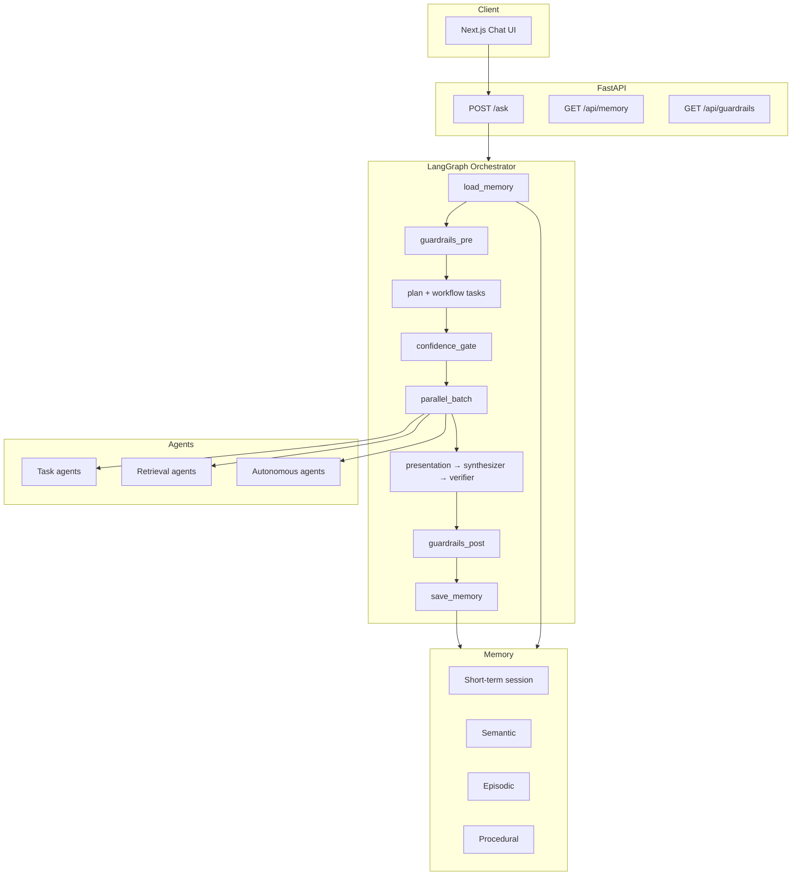

# TelecomGPT Architecture

See **[ORCHESTRATION.md](./ORCHESTRATION.md)** for the full guide: agent taxonomy, memory layers, guardrails, integrations, and ethical AI controls.

## Quick Architecture Diagram



## Agent Summary

| Category | Agents |
| --- | --- |
| Task | analytics, drive_test, log, prediction, presentation, comparison, compliance, deploy, eval |
| Retrieval | research, spec |
| Autonomous | telecom_kb, react |
| Orchestration | synthesizer, verifier |

## Key Endpoints

| Endpoint | Purpose |
| --- | --- |
| `POST /ask` | Multi-agent chat |
| `POST /api/upload` | Session CSV/log upload |
| `GET /api/agents/taxonomy` | Agent classification |
| `GET /api/memory/{id}` | Memory snapshot |
| `POST /api/memory/{id}/refresh` | Compact → long-term |
| `GET /api/guardrails` | Policy & compliance |
| `GET /api/monitoring/runs` | Recent run metrics |

## Setup

```bash
cd backend
pip install -r requirements.txt
uvicorn app:app --port 8000
```

Optional Mem0: `pip install mem0ai` and `TELECOMGPT_MEMORY=mem0`.
