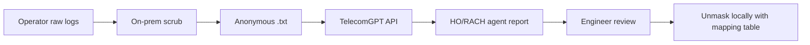

# Handover & RACH Failure Demo — Operator Guide

Manager demo playbook: log types, anonymization (mask before cloud), and step-by-step UI flow.

**UI:** [telecomgpt.vercel.app](https://telecomgpt.vercel.app)  
**Sample log:** [`analytics/samples/ho_demo_anonymized.log`](../analytics/samples/ho_demo_anonymized.log)  
**Related:** [DEMO_MANAGER.md](./DEMO_MANAGER.md) · [LEARNING_SYLLABUS.md](./LEARNING_SYLLABUS.md)

---

## Two meanings of “masking”

| Term | Meaning in this demo |
|------|----------------------|
| **Data masking (privacy)** | Hide IMSI, IMEI, site names before upload → anonymous data to the agent |
| **RNTI masking (5G NR)** | DCI XOR with RNTI on the air interface — **not** operator privacy |

This guide focuses on **data masking for operator privacy**.

---

## What TelecomGPT accepts today

| Data type | Upload? | HO/RACH demo? |
|-----------|---------|---------------|
| UE text log (QXDM/QCAT export `.txt`) | Yes — `.log`, `.txt` | **Best** |
| Synthetic sample logs | Yes | **Safest for manager demo** |
| Drive-test / KPI CSV | Yes — `.csv` | HO + RSRP correlation |
| gNB DU/CU text logs | Yes if exported as `.txt` | Scrub secrets first |
| PCAP / `.pcapng` | **No** | Convert to text first (`tshark`) |
| Raw QXDM `.qmdl` | **No** | Export from QCAT first |

**Auto PII pass (not sufficient alone):** `guardrails.py` redacts IMSI/IMEI-like patterns in chat to `[REDACTED]`. Always **pre-anonymize on-prem** before upload.

---

## Secure data path (tell your manager)



- **Mask** = before cloud (remove subscriber & site identity)
- **Unmask** = operator-side only, using a local PCI/site mapping — TelecomGPT does **not** unmask

---

## 15-minute demo script

### Step 1 — NOC triage (no log, ~2 min)

Enable **Show agent trace**.

**Prompt:**
```text
Handover failure mobilityfromnrcommand target cell not prepared n78
```

**Show:** `fault_analysis` → likely causes, checks, TS 38.331 / 38.423.

**Say:** *“Alarm triage without logs — instant checklist for L2.”*

---

### Step 2 — Test engineer mode (~5 min)

**Upload:** [`analytics/samples/ho_demo_anonymized.log`](../analytics/samples/ho_demo_anonymized.log)

Use **📎 Upload** or **📋 Attach Report**, then ask:

```text
Fault analysis handover failure then RACH failure on target PCI 205
```

**Show:**
- HO sequence: A3 → MobilityFromNRCommand → execution fail → RLF
- Post-HO RACH: PRACH → no RAR → re-PRACH
- Agent trace: `fault_analysis`, optional `log_debug`

**Say:** *“Operator scrubs logs on secure machine; only anonymous text hits the cloud agent.”*

---

### Step 3 — Privacy & roadmap (~3 min)

**Say:**
- Pre-scrub IMSI/IMEI/site names on-prem
- App adds second PII pass on chat
- PCAP/gNB binary stays internal; export decoded RRC lines only
- Pilot: 10–20 scrubbed HO/RACH logs to tune patterns
- Enterprise: private Render / on-prem deploy

---

## Anonymization checklist

### Must remove or replace

| Field | Replace with |
|-------|----------------|
| IMSI / SUPI / MSIN | `[IMSI_REDACTED]` or test PLMN `001010000000001` |
| IMEI / IMEISV | `[IMEI_REDACTED]` |
| ICCID, phone numbers | Remove |
| Exact GPS | Remove or round |
| gNB / site names | `GNB_001`, `SITE_A` |
| Internal IPs | Generic `10.0.0.0` |
| Customer / ticket IDs | Remove |

### Keep for HO/RACH debug

| Field | Why |
|-------|-----|
| PCI, ARFCN, band (n78) | Cell ID |
| RSRP / RSRQ / SINR | RF cause |
| RRC message names | HO phase |
| HARQ, K1, RV, CRC | RACH depth |
| Relative timestamps | Sequence |

---

## On-prem scrub script

Run **before** upload. Review output manually — regex misses SUCI hex, NGAP IDs, etc.

```bash
#!/bin/bash
# analytics/scripts/scrub_log.sh
IN="$1"
OUT="${IN%.log}_anonymized.log"

sed -E \
  -e 's/IMSI[[:space:]]*[0-9]{10,15}/IMSI_REDACTED/gi' \
  -e 's/IMEI[SV]*[[:space:]]*[0-9]{14,16}/IMEI_REDACTED/gi' \
  -e 's/gNB-[A-Za-z0-9_-]+/GNB_XXX/g' \
  -e 's/Site_[A-Za-z0-9_-]+/SITE_XXX/g' \
  "$IN" > "$OUT"

echo "Wrote $OUT — review manually before upload"
```

**PCAP → text (operator side only):**
```bash
tshark -r capture.pcapng -Y "rrc" -V > ho_rrc_export.txt
# scrub ho_rrc_export.txt, then upload
```

---

## Local unmask mapping (never upload)

| Token in anonymized log | Real value (internal only) |
|-------------------------|----------------------------|
| PCI=205 | Site XYZ, gNB-DU-03 |
| GNB_XXX | gNB-Shoreditch-01 |
| SITE_XXX | Customer trial site |

Engineers use this table **after** reading the agent report.

---

## Log content guide

### Handover — UE text log patterns

```text
[RRC] Measurement report serving PCI=101 RSRP=-88 target PCI=205 RSRP=-91
[RRC] MobilityFromNRCommand target PCI=205
[RRC] reconfigurationWithSync failure
[RRC] RLF detected T310 expiry
[RRC] Re-establishment triggered
```

### RACH — UE text log patterns

```text
[RRC] PRACH preamble sent occasion=3
[MAC] No RAR within ra-ResponseWindow
[MAC] Msg3 CRC=NOK harq=0 rv_idx=0
[RRC] ra-ContentionResolutionTimer expired
[RRC] PRACH again attempt=2
```

### gNB text log (optional, after scrub)

```text
HO_PREP_FAIL target_gnb=GNB_B cell_id=205 cause=radioNetwork
XnAP HO preparation timeout
NGAP HandoverPreparationFailure
```

Lead manager demos with **UE log** — easier to follow than gNB OSS text.

---

## Demo prompts

| Scenario | Prompt |
|----------|--------|
| HO prep fail | `Handover failure Xn preparation timeout n78` |
| HO execution fail | `Handover execution failure reconfigurationWithSync PCI 205` |
| HO then RACH | `Fault analysis handover failure then RACH failure on target PCI 205` |
| RACH only | `RACH failure Msg3 CRC fail PRACH re-PRACH` |
| RLF after HO | `RLF after handover failure reestablishment` |

---

## Do / don't

| Do | Don't |
|----|-------|
| Use `ho_demo_anonymized.log` or repo samples | Upload real customer QXDM with IMSI |
| Explain mask-before-cloud | Claim PCAP upload works today |
| Show agent trace | Promise auto gNB parameter fix |
| Mention private deploy for operators | Claim compliance without legal review |

---

## Manager one-liner

> *“We export UE RRC text, scrub subscriber identity on-prem, upload anonymous logs, and get HO/RACH fault playbooks with spec-aligned checks — mapping back to real cells stays inside the operator network.”*

---

## Q&A

| Question | Answer |
|----------|--------|
| Why not PCAP? | Stays in trust zone; export selected RRC decode lines, scrub, upload text. |
| Why not gNB logs first? | UE log shows HO + RACH in one trace; gNB adds prep failures when available. |
| Is cloud safe? | Demo uses synthetic/scrubbed data; production pilot uses anonymized exports or private deploy. |
| What improves next? | Dedicated HO/RACH modules, log pattern scan, OSS counter ingest. |
