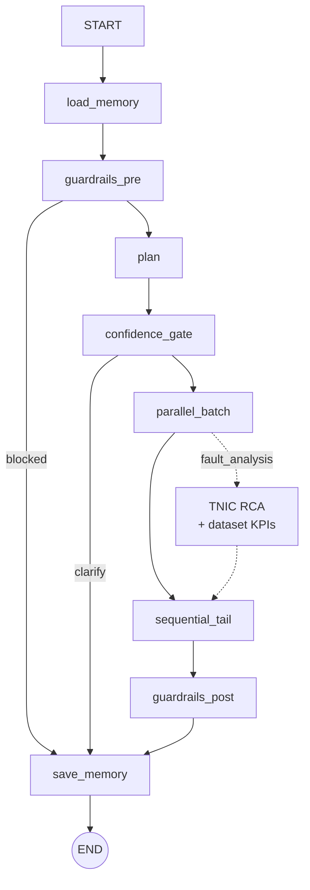
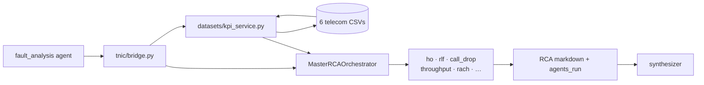
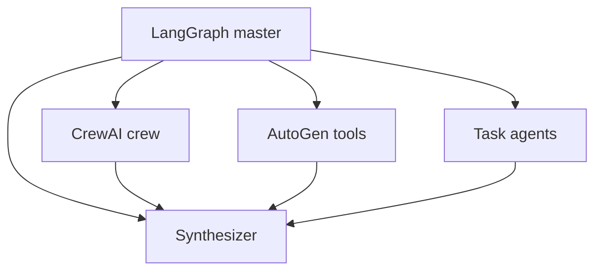

# TelecomGPT AI Orchestration Guide

Next-generation multi-agent orchestration for telecom/RF engineering — built on **LangGraph**, **TNIC RCA engine**, **telecom datasets**, and layered memory.

## Why an AI Orchestrator?

A single LLM call cannot reliably:

- Route domain-specific tasks (drive-test SLA vs 3GPP spec lookup)
- Combine **structured KB** (bands, devices) with **unstructured RAG** (ShareTechnote)
- Run tools in parallel with error isolation
- Persist **short-term** chat context and **long-term** user preferences
- Apply **guardrails** before and after generation

The orchestrator decomposes each user goal into **task**, **retrieval**, and **autonomous** agents, then synthesizes a verified answer.

## Core Components

| Component | Module | Role |
| --- | --- | --- |
| **Workflow engine** | `telecom_ai/orchestrator.py` | LangGraph pipeline |
| **Planner** | `telecom_ai/planning.py` | Keyword + optional LLM plan |
| **Agent dispatch** | `telecom_ai/agent_dispatch.py` | Run specialists by name |
| **Tool registry** | `telecom_ai/tools.py` | Callable tools + allowlists |
| **Memory manager** | `memory/memory_manager.py` | Short/long-term memory |
| **Guardrails** | `telecom_ai/guardrails.py` | Input/output filtering, PII |
| **Workflow tasks** | `telecom_ai/workflow.py` | Task status, error handling |
| **Monitoring** | `telecom_ai/monitoring.py` | Latency, steps, errors |
| **Integrations** | `telecom_ai/integrations/` | Web APIs, serverless |
| **TNIC RCA** | `backend/tnic/orchestrator/` | 12 rule agents + MasterRCAOrchestrator |
| **Dataset KPIs** | `backend/tnic/datasets/kpi_service.py` | Merge 6 CSVs → cell KPIs for RCA |

## Pipeline (LangGraph)



## TNIC RCA path (fault_analysis)

When `fault_analysis` is in the agent plan, LangGraph delegates to the TNIC engine instead of a generic LLM prompt:



Trace ON: UI shows LangGraph plan **and** `tnic_agents_run` in the agent trace panel.

## Agent Taxonomy

### Task agents
Execute bounded workflows with deterministic tools.

| Agent | Tools |
| --- | --- |
| `fault_analysis` | TNIC RCA — 12 rule agents + dataset KPIs (`backend/tnic/`) |
| `log_debug` | UE/QXDM parsing, attach hints |
| `coverage_optimizer` | Drive-test CSV, geo map |
| `analytics` | Kaggle CSV, charts |
| `drive_test` | SLA rules, RF maps |
| `presentation` | PowerPoint |
| `deploy` / `eval` | Status, smoke tests |

### Retrieval agents
Search and cite knowledge (structured + unstructured).

| Agent | Sources |
| --- | --- |
| `research` | Hybrid BM25 + vector RAG, memory |
| `spec` | 3GPP / ShareTechnote chunks |

### Autonomous agents
Dynamic tool selection and reasoning.

| Agent | Behavior |
| --- | --- |
| `telecom_kb` | Multi-tool KB lookups |
| `react` | LLM picks 1–2 tools (ReAct-style) |

### Orchestration agents
| Agent | Role |
| --- | --- |
| `synthesizer` | Merge outputs + LLM |
| `verifier` | KB cross-check |

`GET /api/agents/taxonomy` returns the full map.

## Memory Architecture

| Layer | Type | Storage | TTL |
| --- | --- | --- | --- |
| **Short-term** | Working memory | Session JSON (`session_memory.py`) | Current session, last 100 turns |
| **Long-term** | Vector store | ChromaDB / fallback index | Persistent |

### Cognitive memory kinds

| Kind | Purpose | Example |
| --- | --- | --- |
| **Semantic** | Facts, glossary, band interests | "User interested in n78" |
| **Episodic** | Past Q&A, session summaries | "Q: What is PRACH? A: …" |
| **Procedural** | Successful plans, workflows | "research → telecom_kb → synthesizer" |

### Operations

| Operation | API / code |
| --- | --- |
| **Store** | `MemoryManager.store()`, `persist_exchange()` |
| **Retrieve** | `retrieve_semantic/episodic/procedural()` |
| **Refresh** | `POST /api/memory/{session_id}/refresh` — compacts session → episodic + extracts semantic facts |

### Memory backends (adapters)

| Provider | Env | Package |
| --- | --- | --- |
| **Chroma** (default) | `TELECOMGPT_MEMORY=chroma` | Built-in |
| **Mem0** | `TELECOMGPT_MEMORY=mem0` | `pip install mem0ai` |
| **LangMem** | `TELECOMGPT_MEMORY=langmem` | Chroma-compatible layer |
| **Letta** | `TELECOMGPT_MEMORY=letta` | `LETTA_API_URL`, `LETTA_API_KEY` |

## Data & Knowledge Bases

| Data type | Source | Access |
| --- | --- | --- |
| **Structured** | `telecom_master_db.json`, devices, bands | KB tools, SQL-like lookups |
| **Unstructured** | ShareTechnote RAG chunks, uploads | BM25 + vector hybrid search |
| **Session uploads** | CSV, logs per session | `POST /api/upload` |

## Tools & External Integrations

- **Web APIs** — `telecom_ai.integrations.call_web_api()`
- **Serverless** — `TELECOMGPT_SERVERLESS_URL` + `call_serverless_function()`
- **OpenAI Agents** — `TELECOMGPT_LLM=openai` + `OPENAI_API_KEY`
- **Backend functions** — FastAPI routes (`/api/*`)
- **Lightweight APIs** — urllib-based client (no heavy SDK)

`GET /api/integrations` lists configured integrations.

## Workflow Management

Each plan generates trackable tasks:

```json
{
  "id": "t1-a1b2c3",
  "agent": "research",
  "category": "retrieval",
  "status": "completed",
  "error": null
}
```

Errors are captured per agent; parallel batch continues on individual failures.

## Error Handling & Monitoring

- Per-agent try/catch in parallel batch
- `RunMonitor` records steps, timings, errors
- `GET /api/monitoring/runs` — recent run summaries (dev/admin)

## Security, Compliance & Ethics

| Control | Implementation |
| --- | --- |
| **Input guardrails** | Block harmful network-access prompts |
| **Output filtering** | Unsafe content replacement |
| **PII redaction** | IMSI/IMEI patterns |
| **Tool policies** | Retrieval agents limited to search tools |
| **Regulatory context** | Compliance agent + FCC data |
| **Verifier** | KB band cross-check |
| **Transparency** | Sources panel, agent trace in UI |

`GET /api/guardrails` — policy summary.

## Hybrid Engines — LangGraph + CrewAI + AutoGen

TelecomGPT uses **LangGraph as the master orchestrator**. CrewAI and AutoGen run as **specialist nodes** inside the graph, not as replacements.



| Engine | Agent name | When used |
| --- | --- | --- |
| **LangGraph** | (pipeline) | Always — memory, guardrails, workflow |
| **CrewAI** | `crew` | Hybrid: multi-domain queries, PPT reports; `TELECOMGPT_ENGINE=crew` for crew-only |
| **AutoGen** | `autogen` | Hybrid: replaces `react` for autonomous tool loops |

| Env var | Default | Values |
| --- | --- | --- |
| `TELECOMGPT_ENGINE` | `hybrid` | `langgraph` / `hybrid` / `crew` / `autogen` |
| `TELECOMGPT_AUTONOMOUS` | (auto) | `react` / `autogen` — override autonomous agent |

`GET /api/engines` — installed engines and active mode.

**Fallbacks:** If `crewai` or `pyautogen` are not installed (or no API key), internal fallback crew + ReAct run automatically. These packages are **not** in `requirements.txt` (they conflict and break Render builds). Optional local install: `pip install -r requirements-engines.txt`.

## LangChain / LangGraph / OpenAI Agents

| Framework | Role in TelecomGPT |
| --- | --- |
| **LangGraph** | Master orchestrator graph, optional `MemorySaver` checkpoint |
| **CrewAI** | Role-based Researcher + RF Engineer + Compliance crew |
| **AutoGen** | Multi-turn autonomous tool calling |
| **LangChain-core** | Compatible tool/message patterns |
| **OpenAI** | Synthesis, CrewAI/AutoGen LLM backend |
| **Multi-agent** | Parallel specialists + sequential synthesizer |

## Next-Gen Agent Protocols (roadmap)

- **MCP** (Model Context Protocol) — expose tools to external clients
- **A2A** (Agent-to-Agent) — delegated sub-tasks between agents
- **Streaming SSE** — `/ask` stream for live workflow updates

## Configuration

| Env var | Default | Purpose |
| --- | --- | --- |
| `TELECOMGPT_ENGINE` | `hybrid` | `langgraph` / `hybrid` / `crew` / `autogen` |
| `TELECOMGPT_AUTONOMOUS` | (auto) | `react` / `autogen` |
| `TELECOMGPT_MODE` | `orchestrator` | `legacy` for keyword router |
| `TELECOMGPT_MEMORY` | `chroma` | `mem0` / `langmem` / `letta` |
| `TELECOMGPT_LLM` | `auto` | `openai` / `ollama` |
| `TELECOMGPT_CHECKPOINT` | `0` | LangGraph MemorySaver |
| `TELECOMGPT_SERVERLESS_URL` | — | Serverless hook base URL |
| `LETTA_API_URL` | — | Letta memory API |

## File Map

```
backend/telecom_ai/
  orchestrator.py       LangGraph pipeline
  guardrails.py         Input/output policy
  workflow.py           Task tracking
  monitoring.py         Run observability
  agents/taxonomy.py    Task / retrieval / autonomous
  engines/              CrewAI + AutoGen hybrid runners
    crew_runner.py
    autogen_runner.py
    tool_bridge.py
  engine_plan.py        Hybrid routing in planner
backend/memory/
  memory_manager.py     Semantic / episodic / procedural
  adapters.py           Mem0, LangMem, Letta, Chroma
  session_memory.py     Short-term working memory
  vector_store.py       Long-term vector index
```
