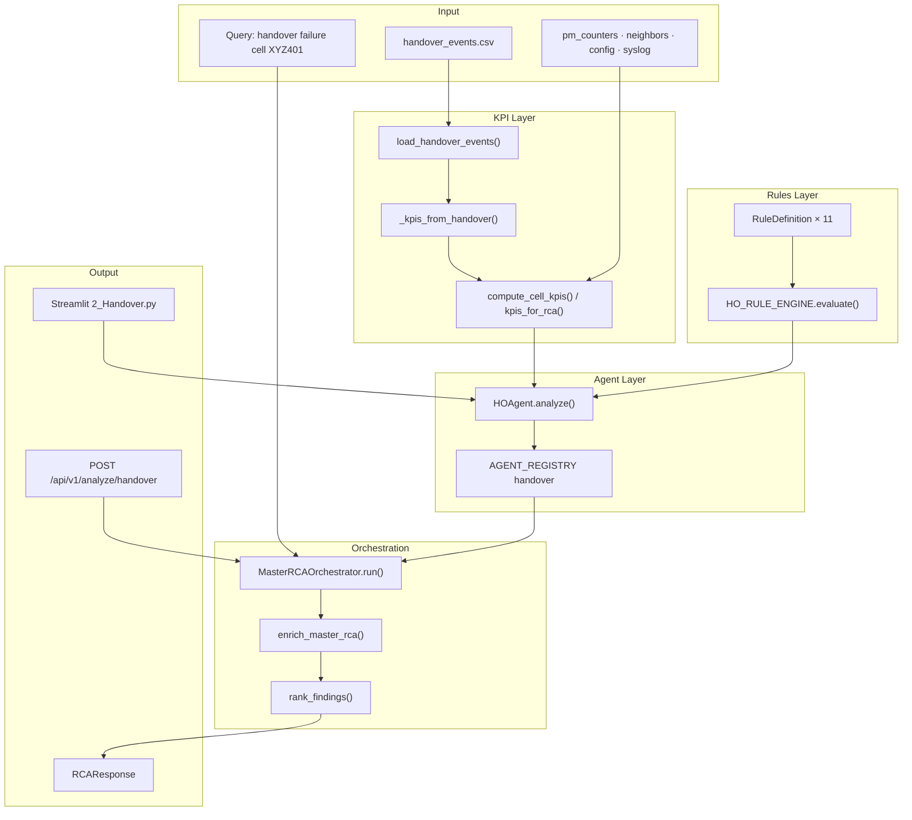
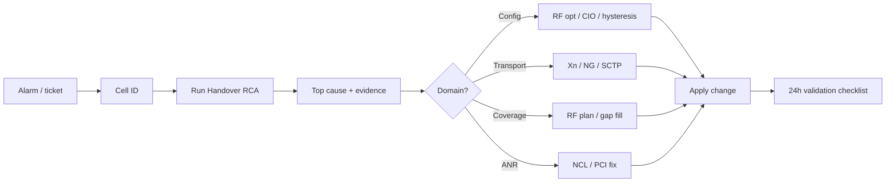

# End-to-End RCA Agent Process (Handover Agent Example)

**Audience:** Developers building new agents · NOC engineers triaging mobility incidents  
**Platform:** TNIC (Telecom Network Intelligence Copilot)  
**Last updated:** 2026-07-05

**Related:** [ARCHITECTURE.md](./ARCHITECTURE.md) · [TNIC_RCA_TECH_STACK_AND_QA.md](./TNIC_RCA_TECH_STACK_AND_QA.md) · [DEMO_HANDOVER_OPERATOR.md](./DEMO_HANDOVER_OPERATOR.md) · [xyz_tnic/README.md](../xyz_tnic/README.md)

---

## Summary

TNIC RCA agents are **thin wrappers over rule engines**. Telecom logic lives in:

1. **Datasets** → KPI aggregation  
2. **Rules** → threshold conditions, confidence, actions  
3. **Agents** → call rules, return findings  
4. **Orchestrator** → multi-agent fan-out, enrichment, ranking  
5. **API / Dashboard** → operator and engineer interfaces  

The **Handover (HO) agent** is the reference example: default issue type, full dataset → API → dashboard path, and 11 mobility rules.

---

## Part 1 — Architecture (All Audiences)



| Layer | Folder | Responsibility |
|-------|--------|----------------|
| Dataset | `tnic/datasets/` | CSV registry, loaders, validation, KPI merge |
| Rules | `tnic/rules/` | Thresholds, confidence, actions, evidence keys |
| Agents | `tnic/agents/` | Rule engine → `AgentResult` |
| Orchestrator | `tnic/orchestrator/` | Multi-agent chain, enrichment, ranking |
| Models | `tnic/models/schemas.py` | `KPIInput`, `RuleFinding`, `RCAResponse` |
| API | `tnic/api/routes/analyze.py` | FastAPI endpoints |
| Dashboard | `xyz_tnic/dashboard/` | Streamlit per-domain pages |

Code paths: `backend/tnic/` (production API) and `xyz_tnic/tnic/` (mirror + dashboard/tests).

---

## Part 2 — How to Build Any RCA Agent (Developers)

Every specialist agent follows the same **7-step pattern**.

### Step 1 — Define the dataset

Register CSV in `tnic/datasets/registry.py`:

```python
HANDOVER_EVENTS = "handover_events"
DATASET_FILES = { DatasetName.HANDOVER_EVENTS: "handover_events.csv" }
```

**Handover CSV schema** (`datasets/handover_events.csv`):

| Column | Example | Notes |
|--------|---------|-------|
| `ue_id` | UE10618 | UE identifier |
| `cell_id` | XYZ401 | Serving cell |
| `rsrp` | -118 | dBm at HO |
| `sinr` | 22 | dB |
| `failure_type` | WRONG_CELL | See allowed values below |

**Allowed `failure_type` values:**  
`SUCCESS`, `PREP_FAILURE`, `EXEC_FAILURE`, `TOO_EARLY_HO`, `TOO_LATE_HO`, `PING_PONG`, `WRONG_CELL`, `XN_FAILURE`, `N2_FAILURE`

### Step 2 — Loader + validation

```python
# tnic/datasets/loaders.py
def load_handover_events(path=None) -> pd.DataFrame:
    return _read_csv(DatasetName.HANDOVER_EVENTS, path)
```

HO events use structured CSV (no custom parser). For syslog/UE uploads, use `services/ingest_pipeline.py` → `events_kpi_bridge.py` to derive KPIs like `ho_prep_fail_rate`.

### Step 3 — KPI aggregation

Raw events → flat KPI dict (`tnic/datasets/kpi_service.py`):

| KPI key | Source |
|---------|--------|
| `ho_success_rate` | SUCCESS / total events |
| `ho_prep_fail_rate` | PREP_FAILURE / total |
| `ho_exec_fail_rate` | EXEC_FAILURE / total |
| `ho_too_early_rate` | TOO_EARLY_HO / total |
| `ho_too_late_rate` | TOO_LATE_HO / total |
| `ho_ping_pong_rate` | PING_PONG / total |
| `ho_wrong_cell_rate` | WRONG_CELL / total |
| `ho_xn_fail_rate` | XN_FAILURE / total |
| `ho_n2_fail_rate` | N2_FAILURE / total |
| `target_rsrp` | Mean RSRP on non-SUCCESS events |

`compute_cell_kpis()` merges HO KPIs with PM, RLF, ANR, neighbor count, PCI conflicts, syslog fields.

### Step 4 — Write rules

Each rule is a `RuleDefinition` in `tnic/rules/ho_rules.py`:

| Field | Purpose |
|-------|---------|
| `rule_id` | Stable identifier (e.g. `ho_prep_failure`) |
| `condition(kpis)` | Python callable → True fires rule |
| `probable_cause` | Human-readable root cause |
| `confidence` | Fixed score 0.69–0.82 |
| `actions` | Recommended fixes |
| `evidence_keys` | KPI fields attached to finding |

Base engine: `tnic/rules/engine.py` — `RuleEngine.evaluate(kpis)` runs all conditions, sorts by confidence.

### Step 5 — Create the agent

```python
# tnic/agents/specialists.py
class HOAgent(_RuleAgent):
    def __init__(self):
        super().__init__("ho_agent", HO_RULE_ENGINE)

AGENT_REGISTRY = { "handover": HOAgent(), "ho": HOAgent() }
RULE_ENGINES = { "handover": HO_RULE_ENGINE, "ho": HO_RULE_ENGINE }
```

Agents are **thin**: `analyze()` → `kpi_to_dict()` → `engine.evaluate()` → `AgentResult`.

### Step 6 — Wire orchestrator + catalog

| File | What to add |
|------|-------------|
| `orchestrator/rca_orchestrator.py` | Agent chain in `ORCHESTRATION_MAP["handover"]` |
| `rules/__init__.py` | Issue keywords in `ISSUE_KEYWORDS` |
| `orchestrator/rca_catalog.py` | NOC workflow entry (28-type catalog) |
| `orchestrator/workflow_registry.py` | Industry workflow spec |

**Default handover agent chain:**

```text
handover → rlf → pm → latency → transport → anr → gnb_syslog → alarm
         + ue_protocol, vonr, config_audit (assurance)
```

### Step 7 — API, dashboard, tests

| Surface | Location |
|---------|----------|
| API | `POST /api/v1/analyze/handover` · `POST /api/v1/analyze-ho` |
| Dashboard | `xyz_tnic/dashboard/pages/2_Handover.py` |
| Tests | `xyz_tnic/tests/test_agents.py` · `test_orchestrator.py` |

**Run tests:**

```bash
cd xyz_tnic && pytest tests/test_agents.py tests/test_orchestrator.py -q
```

---

## Part 3 — Handover Rules Reference

| Rule ID | Fires when | Confidence | First actions |
|---------|-----------|------------|---------------|
| `ho_prep_failure` | prep fail rate > 5% | 0.82 | Verify Xn; check NCL for target PCI; review HO prep timer |
| `ho_execution_failure` | exec fail > 2% OR success < 95% | 0.78 | Compare source/target RSRP; audit A3/A5; drive-test corridor |
| `ho_xn_failure` | Xn fail rate > 2% | 0.80 | Check Xn transport/SCTP; verify Xn neighbor |
| `ho_n2_failure` | N2 fail rate > 2% | 0.77 | Check AMF/NGAP timers; inspect HandoverFailure cause |
| `ho_too_early` | too-early rate > 3% | 0.71 | Increase A3 offset or TTT; review CIO |
| `ho_too_late` | too-late rate > 3% | 0.73 | Decrease A3 offset; add filler cell |
| `ho_ping_pong` | ping-pong rate > 5% | 0.76 | Increase hysteresis; review CIO |
| `ho_wrong_cell` | wrong-cell rate > 2% | 0.69 | Verify NCL; check SSB beam priority |
| `ho_weak_target_rf` | target RSRP < -110 dBm | 0.80 | Close coverage gap; adjust mobility thresholds |
| `ho_missing_neighbor` | neighbors < 3 AND prep fail > 3% | 0.81 | Add NCR via ANR; validate allow-list |
| `ho_pci_collision` | PCI conflicts > 0 | 0.79 | PCI replan; ANR PCI correction |

**Scoring:** Fixed per-rule confidence. Orchestrator adds +0.10 when finding category matches primary issue (mobility).

---

## Part 4 — End-to-End Flow (Handover Example)

### Path A — Dashboard single agent

```text
User selects cell XYZ401 (Handover page)
  → cell_kpis("XYZ401") loads handover_events.csv + PM merge
  → run_agent("handover", "XYZ401")
  → HOAgent.analyze(kpis)
  → HO_RULE_ENGINE.evaluate(kpis)
  → Dashboard shows summary + findings table
```

### Path B — Master RCA (API / RCA Report page)

```text
POST /api/v1/analyze/handover
  { "query": "handover failure cell XYZ401", "kpis": { "cell_id": "XYZ401" } }
  → detect_issue_type() → "handover"
  → kpis_for_rca() merges dataset KPIs
  → Run agent chain (handover + rlf + pm + … + assurance)
  → enrich_master_rca() — cross-domain correlations
  → rank_findings() — boost mobility findings
  → RCAResponse: causes, actions, checklist, health score
```

### Example API call

```bash
curl -X POST https://telecomgpt.onrender.com/api/v1/analyze/handover \
  -H "Content-Type: application/json" \
  -d '{"query": "handover failure cell XYZ401", "kpis": {"cell_id": "XYZ401"}}'
```

---

## Part 5 — NOC Engineer Guide

### When to run Handover RCA

| Trigger | Example |
|---------|---------|
| HO success below SLA | HO SR < 95% |
| Prep/execution spike | NGAP/XnAP failures in syslog |
| Mobility complaints | Drops at cell edge, ping-pong |
| Post-HO RLF | RLF cause = Post_HO |

**Industry workflow:** Handover Failure (4G/5G)  
**Domains:** Mobility · Coverage · Transport  
**Data needed:** HO counters, NCL, A3/A2, drive logs, Xn/NG traces

### How to run it

| Method | Steps |
|--------|-------|
| **Dashboard** | Handover page → select cell → review KPI tiles + HO Agent findings |
| **Master RCA** | RCA Report → preset `handover failure cell XYZ401` |
| **API / Chat** | Query: `handover failure cell XYZ401` or `ping pong between neighbors` |

### NOC triage workflow



### Escalation guide

| Finding pattern | Escalate to |
|-----------------|-------------|
| Prep fail / Xn / N2 high | Transport / Core (Xn, SCTP, NGAP, AMF) |
| Ping-pong / too early-late / wrong cell | RF Optimization (A3, hysteresis, CIO) |
| Weak RSRP / too late / post-HO RLF | Coverage / site design |
| Missing neighbor / PCI conflict | ANR / planning |

### Reading RCA output

| Field | NOC use |
|-------|---------|
| Health score | Cell grade A–D; mobility alert if dimension < 60 |
| Probable root causes | Top 5 ranked — start with #1 |
| Evidence | Actual KPI values (e.g. `ho_prep_fail_rate: 8.2%`) |
| Recommended actions | De-duplicated fix list |
| Validation checklist | Sign-off after change |

**Handover validation checklist:**

- [ ] HO success rate restored to SLA  
- [ ] No prep-fail spike on neighbor pair  
- [ ] Fix holds for 24h monitoring window  
- [ ] Re-run drive test or PM export on affected cells  
- [ ] Document root cause and action in incident record  

### Mobility health thresholds

| HO success rate | Mobility health |
|-----------------|-----------------|
| ≥ 98% | Good |
| 95–98% | Fair — monitor |
| < 95% | Critical — run HO RCA |

### Query cheat sheet

| Query | Routes to |
|-------|-----------|
| `handover failure cell XYZ401` | Full handover RCA chain |
| `ping pong between neighbors` | Ping-pong HO workflow |
| `ho prep failure cell XYZ401` | Prep + transport + ANR |
| `xn failure handover` | Xn transport + HO agent |
| `call drop handover cell XYZ401` | Call drop + HO + RLF |

### Data to attach to tickets

| Data | Purpose |
|------|---------|
| Cell ID | Required for KPI merge |
| PM export | HO attempt/success counters |
| HO event log / drive test | Failure type mix |
| Neighbor list (NCL) | Missing/wrong neighbor |
| gNB syslog | NGAP/XnAP signatures |
| UE trace | Layer-level HO correlation |
| Config snapshot | A3, A5, hysteresis validation |

---

## Part 6 — Example Incident (Cell XYZ401)

**Ticket:** High wrong-cell HO and weak RSRP at sector edge.

**Observed in data:**

- Many `WRONG_CELL` events  
- RSRP -118 to -121 dBm on failures  
- Target RSRP below -110 dBm  

**Likely findings:**

1. Wrong cell selection — verify NCL, SSB beam priority  
2. Weak target RF — close coverage gap  
3. HO execution failure (if HO SR < 95%) — drive-test corridor  

**Cross-domain checks (Master RCA):**

| Agent | Why |
|-------|-----|
| RLF | Post-HO RLF on same cell? |
| RF coverage | Coverage hole at edge? |
| ANR | Missing/wrong neighbors? |
| Transport | Xn masking as HO fail? |
| gNB syslog | NGAP HandoverPreparationFailure? |
| Config audit | A3/A5/hysteresis out of spec? |

---

## Part 7 — Key Files (Handover Agent)

| File | Purpose |
|------|---------|
| `datasets/handover_events.csv` | Primary HO event data |
| `datasets/registry.py` | Dataset registration |
| `datasets/loaders.py` | `load_handover_events()` |
| `datasets/kpi_service.py` | `_kpis_from_handover()` |
| `rules/ho_rules.py` | 11 HO rules + `HO_RULE_ENGINE` |
| `rules/engine.py` | Base `RuleEngine` |
| `rules/__init__.py` | Registry + `detect_issue_type()` |
| `agents/base.py` | `BaseAgent`, `kpi_to_dict()` |
| `agents/specialists.py` | `HOAgent`, `AGENT_REGISTRY` |
| `orchestrator/rca_orchestrator.py` | `MasterRCAOrchestrator` |
| `orchestrator/master_rca.py` | Cross-domain enrichment |
| `orchestrator/rca_catalog.py` | 28-type NOC RCA routing |
| `orchestrator/workflow_registry.py` | Industry workflows |
| `api/routes/analyze.py` | REST endpoints |
| `dashboard/pages/2_Handover.py` | Streamlit HO page |
| `tests/test_agents.py` | Unit tests |

---

## Part 8 — Extending the Handover Agent

1. Add rows to `handover_events.csv` or assurance CSVs  
2. Expose new KPI in `_kpis_from_handover()` or assurance ingestion  
3. Add `RuleDefinition` in `ho_rules.py` (no agent code change)  
4. Optional: register in `rca_catalog.py` for distinct NOC workflow  
5. Verify via dashboard `2_Handover.py` or `POST /analyze/handover`  

---

## Part 9 — Design Principles

| Principle | Meaning |
|-----------|---------|
| Agents are thin | `HOAgent` delegates to `HO_RULE_ENGINE` only |
| Rules are explicit | Thresholds are readable Python, not black-box LLM |
| KPIs are the contract | Rules see a flat `dict[str, Any]` |
| Orchestrator adds intelligence | Multi-agent fan-out, enrichment, ranking |
| LLM is optional | `generate_report=true` adds narrative; core RCA is deterministic |

---

## Part 10 — RCA Catalog (Handover-Related NOC Workflows)

| Catalog key | Title | Key rules |
|-------------|-------|-----------|
| `ho_prep_failure` | HO Prep Failure RCA | `ho_prep_failure`, `ho_missing_neighbor` |
| `ho_execution_failure` | HO Execution Failure RCA | `ho_execution_failure`, `ho_weak_target_rf` |
| `ping_pong` | Ping Pong HO RCA | `ho_ping_pong` |
| `too_early_ho` | Too Early HO RCA | `ho_too_early` |
| `too_late_ho` | Too Late HO RCA | `ho_too_late` |
| `xn_failure` | Xn Failure RCA | `ho_xn_failure` |
| `ng_n2_failure` | NG/N2 Failure RCA | `ho_n2_failure` |
| `neighbor_missing` | Neighbor Missing RCA | `ho_missing_neighbor` |
| `pci_conflict` | PCI Conflict RCA | `ho_pci_collision` |

Full catalog: `GET /api/v1/rca/catalog`
