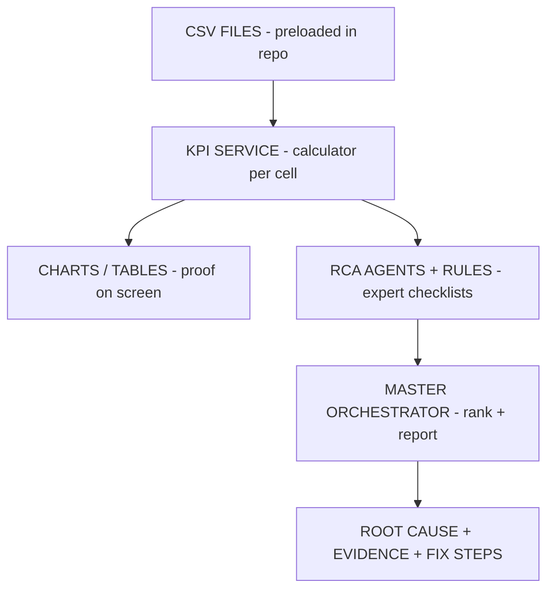

# RCA Dashboard — Manager Explainer

**Audience:** Management, NPI, NOC leads  
**Platform:** XYZ Telecom Network Intelligence Copilot (TNIC)  
**Demo cells:** XYZ401–XYZ410  
**Last updated:** 2026-07-12

**Related:** [TNIC_FULL_IMPLEMENTATION_OVERVIEW.md](./TNIC_FULL_IMPLEMENTATION_OVERVIEW.md) · [TNIC_DASHBOARD_DATA_FLOW.md](./TNIC_DASHBOARD_DATA_FLOW.md) · [RCA_MANAGER_EXPLAINER.pdf](./RCA_MANAGER_EXPLAINER.pdf)

---

## 1. The big picture in one story

Imagine a **network operations center (NOC)** for 10 cell sites (XYZ401–XYZ410).

**Normally a human engineer would:**

1. Download logs and PM counters from many tools  
2. Open Excel, filter by cell  
3. Calculate success rates and failure rates  
4. Apply experience: “If HO prep fail is high, check Xn…”  
5. Write a report: root cause + recommended fixes  

**Our RCA dashboard automates that workflow:**

| Human step | Our system |
|------------|------------|
| Download logs | **Preloaded CSV files** (already in the repo) |
| Open Excel | **Loaders** read CSV into memory |
| Calculate rates | **KPI Service** summarizes per cell |
| Apply experience | **Rules** (telecom checklists) |
| Specialist review | **Agents** (Handover, RLF, VoNR, …) |
| Final report | **Master Orchestrator** (RCA Report page) |

**Important:** In the demo, data is **not live from the network**. It is **sample data that looks like real OSS exports**, stored in files, so we can demo the full RCA flow without connecting to production.

---

## 2. What gets preloaded (before you open the dashboard)

### Where the data lives

| Location | Path |
|----------|------|
| GitHub | `telecomgpt/datasets/` |
| Cloud Agent | `/workspace/datasets/` |
| Files | **15 CSV files** (like 15 Excel workbooks) |

Browse on GitHub: https://github.com/aqil2020in/telecomgpt/tree/main/datasets

### Examples of what’s inside

| File | What it represents |
|------|---------------------|
| `handover_events_enriched.csv` | Every handover attempt — success, prep fail, ping-pong, etc. |
| `rlf_events.csv` | Radio link failures |
| `call_drop_events.csv` | Dropped calls |
| `pm_counters.csv` | Performance counters (throughput, HO attempts, CQI) |
| `vonr_sessions.csv` | Voice (VoNR) sessions |
| `alarm_events.csv` | FM alarms |

Each row has a **cell ID** (e.g. `XYZ401`), so the system can filter “show me only XYZ401.”

### You did NOT input this in the UI

- Data was **created once** (synthetic demo data)  
- **Committed to GitHub**  
- Dashboard **reads it automatically** when it starts  

**Your only input:** pick a cell from the dropdown (e.g. XYZ401).

---

## 3. The five layers (memorize for manager)

```
Layer 5  DASHBOARD PAGES     What manager sees (charts, findings, report)
Layer 4  RCA AGENTS          "Expert doctors" (Handover, RLF, VoNR…)
Layer 3  RULES               Checklists ("if metric > threshold → flag issue")
Layer 2  KPI SERVICE         Summary numbers per cell (87% HO success…)
Layer 1  DATASETS (CSV)      Raw events and counters
```

**Data flows upward:** CSV → KPIs → Rules → Agents → Screen

---

## 4. Example A — Handover page (step by step)

**Demo path:** Sidebar → **Handover** → Cell **XYZ401**

### Step 1 — You open the page

| Item | Detail |
|------|--------|
| **File** | `xyz_tnic/dashboard/pages/2_Handover.py` |
| **What it does** | Draws the Handover screen — title, cell dropdown, charts, findings |

**Say to manager:**  
> “This is the Handover screen — like opening the Mobility tab in a network tool.”

### Step 2 — You select XYZ401

| Item | Detail |
|------|--------|
| **File** | `xyz_tnic/dashboard/dashboard_utils.py` |
| **What it does** | Shared helper: get KPIs, get events, run Handover agent |

**Say to manager:**  
> “One shared connector links the UI to the data and the RCA engine.”

### Step 3 — System finds the data folder

| Item | Detail |
|------|--------|
| **File** | `xyz_tnic/tnic/datasets/registry.py` |
| **What it does** | Points to `/workspace/datasets/` (or `TNIC_DATASETS_DIR`) |

### Step 4 — System reads the handover CSV

| Item | Detail |
|------|--------|
| **File** | `xyz_tnic/tnic/datasets/loaders.py` |
| **Data** | `handover_events_enriched.csv` |

Example rows (conceptually):

| UE | Source cell | Failure type | RSRP |
|----|-------------|--------------|------|
| UE10711 | XYZ401 | PING_PONG | -88 |
| UE10443 | XYZ401 | PREP_FAILURE | -112 |
| UE10622 | XYZ401 | SUCCESS | -78 |

### Step 5 — KPI Service summarizes XYZ401

| Item | Detail |
|------|--------|
| **File** | `xyz_tnic/tnic/datasets/kpi_service.py` |

Example output:

| KPI | Meaning | Example |
|-----|---------|---------|
| `ho_success_rate` | % successful handovers | 87% |
| `ho_prep_fail_rate` | % preparation failures | 8.2% |
| `ho_ping_pong_rate` | % ping-pong HOs | 5.1% |
| `ho_xn_fail_rate` | % Xn interface failures | 2.3% |

**Say to manager:**  
> “KPI Service is the calculator. It turns thousands of events into a one-page vitals summary for that cell.”

### Step 6 — Two things appear on screen

**A) Top metrics** — from KPI Service (HO success %, prep fail %, …)  
**B) Charts and table** — from raw CSV rows (proof / evidence)

**Say to manager:**  
> “Top numbers = summary. Charts and table = proof.”

### Step 7 — Handover Agent runs

| Files | Role |
|-------|------|
| `agents/specialists.py` | `HOAgent` |
| `rules/ho_rules.py` | Handover checklist |
| `rules/engine.py` | Runs each rule |

Example rules (plain English):

| If… | Then finding… |
|-----|----------------|
| Prep fail rate > 5% | HO preparation failure — check Xn / neighbor |
| Ping-pong rate > 5% | Ping-pong HO — tune hysteresis |
| Too-late HO rate > 3% | Too-late HO — adjust A3 offset |
| Target RSRP too weak | Weak target RF — coverage gap |

Each finding includes: **probable cause**, **confidence**, **evidence**, **recommended actions**.

### Step 8 — Final output on Handover page

Bottom section: **“HO Agent findings”** — table of causes, confidence, and fix steps.

**Say to manager:**  
> “This is RCA for one domain — mobility/handover only. One dataset, one expert, one checklist.”

### Handover file chain

```
pages/2_Handover.py
  → dashboard_utils.py
    → registry.py + loaders.py
    → kpi_service.py
    → specialists.py (HOAgent)
    → ho_rules.py + engine.py
  → screen (charts + findings)
```

---

## 5. Example B — RCA Report (full multi-agent)

**Demo path:** Sidebar → **RCA Report** → **XYZ401** → preset **“Handover failure”** → **Run Master RCA**

### What’s different from Handover page?

| Handover page | RCA Report page |
|---------------|-----------------|
| “How is HO?” | “**Why** is HO failing?” |
| Mainly one CSV | **All CSVs** merged |
| One agent | **Many agents** (8–12) |
| Few findings | **Ranked** final answer + report |

### Step 1 — You enter a question

| Item | Detail |
|------|--------|
| **File** | `pages/8_RCA_Report.py` |
| **Example query** | `handover failure cell XYZ401` |

### Step 2 — KPI Service merges everything

| Files | Role |
|-------|------|
| `kpi_service.py` | PM, HO, RLF, drops, RACH, throughput, … |
| `assurance_ingestion.py` | VoNR, alarms, syslog, config, ANR |

One **full cell health profile** for XYZ401.

### Step 3 — Master Orchestrator picks experts

| File | `orchestrator/rca_orchestrator.py` |

For a handover question, typically runs: Handover, RLF, PM, Transport, ANR, Syslog, Alarm, …

**Say to manager:**  
> “The orchestrator is the team lead — it convenes a multi-disciplinary review.”

### Step 4 — Each agent runs its rules

| Files | `specialists.py` + `rules/*.py` |

Each agent returns findings. Example set:

| Agent | Example finding |
|-------|-----------------|
| Handover | Prep failure rate high |
| RLF | Post-HO RLF elevated |
| Alarm | Critical transport alarm |
| Coverage | Weak target RSRP |

### Step 5 — Rank and enrich

| Files | Role |
|-------|------|
| `master_rca.py` | Link related issues (coverage → HO + RLF) |
| `rca_orchestrator.py` | Rank by confidence + domain boost |

### Step 6 — Health score

| File | `services/health_scoring.py` |
| Output | e.g. **52/100** for XYZ401 |

### Step 7 — Final outcome on screen

Manager typically sees:

1. **Issue domain** (e.g. handover)  
2. **Health score** (e.g. 52/100)  
3. **Agents run** (list of experts)  
4. **Executive summary** (optional)  
5. **Root cause** (top ranked)  
6. **Evidence** (supporting metrics)  
7. **Recommendations** (numbered fix steps)  
8. **Confidence** (e.g. 94%)  
9. **Full findings table** (audit trail)  

Optional narrative: `services/report_generator.py` (LLM optional).

### RCA Report file chain

```
pages/8_RCA_Report.py
  → dashboard_utils.py (run_rca)
  → kpi_service.py + assurance_ingestion.py
  → rca_orchestrator.py
  → specialists.py + rules/*.py
  → master_rca.py + health_scoring.py
  → report_generator.py (optional)
  → final RCA report on screen
```

---

## 6. Finding vs final outcome

### Finding (one rule fired)

- **Rule ID:** `ho_prep_failure`  
- **Probable cause:** High HO preparation failure  
- **Confidence:** 82%  
- **Evidence:** `ho_prep_fail_rate: 8.2`  
- **Actions:** Verify Xn connectivity  

### Final outcome (RCA Report)

- **Primary root cause** (ranked #1)  
- **Secondary causes**  
- **Health score**  
- **Recommendations** (ordered fix plan)  
- **Confidence** on top cause  

**Analogy:** Finding = one lab flag. Final outcome = consultant’s signed diagnosis.

---

## 7. Which `.py` files for what?

| Plain English | Python file |
|---------------|-------------|
| The screen | `dashboard/pages/*.py` |
| Glue UI ↔ engine | `dashboard/dashboard_utils.py` |
| Where CSVs live | `datasets/registry.py` |
| Read CSV files | `datasets/loaders.py` |
| Calculate metrics | `datasets/kpi_service.py` |
| Expert agents | `agents/specialists.py` |
| Checklists | `rules/ho_rules.py`, `rlf_rules.py`, … |
| Run checklist | `rules/engine.py` |
| Team lead | `orchestrator/rca_orchestrator.py` |
| Link related issues | `orchestrator/master_rca.py` |
| Health score | `services/health_scoring.py` |
| Optional narrative | `services/report_generator.py` |

**Handover demo (6 core files):**  
`2_Handover.py` → `dashboard_utils.py` → `loaders.py` + `kpi_service.py` → `specialists.py` → `ho_rules.py`

---

## 8. Manager FAQ

| Question | Answer |
|----------|--------|
| Where did the data come from? | Preloaded CSV files in GitHub `datasets/` — not typed live during demo. |
| Who calculates the percentages? | KPI Service (`kpi_service.py`) from CSV rows. |
| Who decides the root cause? | Rules + agents + orchestrator ranking — not manual entry. |
| Is it AI / ChatGPT? | Core RCA is rule-based. AI is optional for narrative text only. |
| Can we trust it? | Every finding has evidence and a rule ID — auditable. |
| Real network later? | Replace CSVs with real PM/FM exports; same agents and rules. |
| Business value? | Faster RCA, one view across domains, consistent recommendations. |

---

## 9. Five-minute live demo script

| Minute | Action | What to say |
|--------|--------|-------------|
| 0–1 | Open home, show 10 cells | “Preloaded demo cluster XYZ401–410.” |
| 1–2 | Handover → XYZ401 | “Events become KPIs; charts are proof.” |
| 2–3 | HO Agent findings | “One expert, one checklist — cause, confidence, actions.” |
| 3–4 | RCA Report → Run Master RCA | “Full team of experts on same data.” |
| 4–5 | Root cause, evidence, recommendations | “Final RCA outcome for a ticket.” |

**Closing line:**

> “We preload representative network data, summarize it per cell, run telecom expert rules through RCA agents, and deliver a ranked root cause with evidence and fix steps — Handover shows one specialist; RCA Report shows the full multi-agent outcome.”

---

## 10. Architecture diagram



---

## 11. One-sentence summary

> **We preload demo network data in CSV files; when you pick a cell, the system summarizes it into KPIs, runs telecom expert rules through RCA agents, and delivers a ranked root cause with evidence, confidence, and fix steps — Handover page shows one expert, RCA Report shows the full team.**
