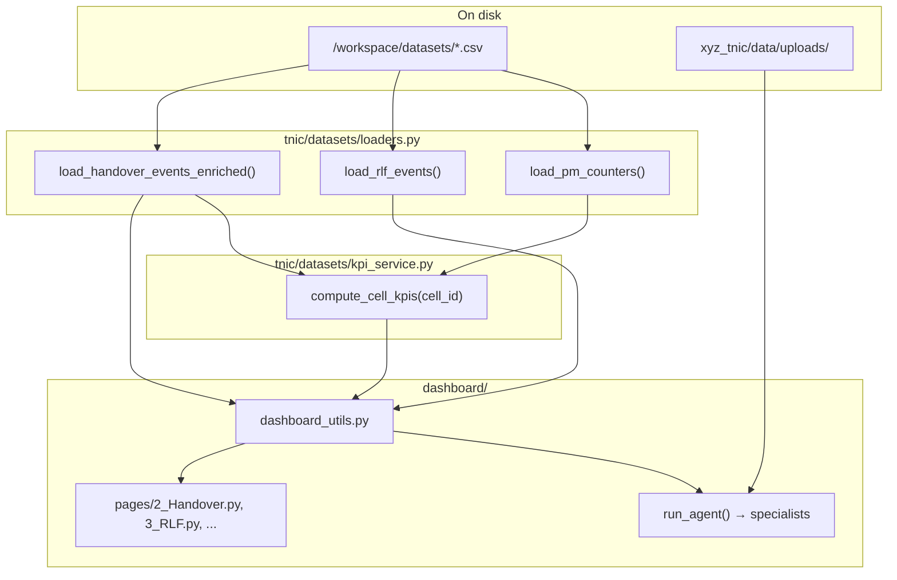

# TNIC Dashboard — Data Preload & Sidebar Page Flow

**Audience:** NPI engineers, management demos, developers  
**Platform:** XYZ Telecom Network Intelligence Copilot (TNIC)  
**Last updated:** 2026-07-12

**Related:** [RCA_AGENT_END_TO_END_HANDOVER.md](./RCA_AGENT_END_TO_END_HANDOVER.md) · [ARCHITECTURE.md](./ARCHITECTURE.md) · [xyz_tnic/README.md](../xyz_tnic/README.md)

---

## Summary

The Streamlit sidebar pages (**app**, **Handover**, **RLF**, **Call Drops**, etc.) do **not** pull from a live OSS or Nokia network. They read **preloaded synthetic CSV files** from disk, aggregate KPIs in Python, and run rule-based RCA agents on demand.

There are two data paths:

1. **Preloaded demo datasets** — used by most sidebar pages (Handover, RLF, VoNR, …)
2. **User uploads** — used by **Upload** and **Dataset Upload & Agent Simulation** on the home page

---

## 1. How the sidebar is built

Streamlit **multipage** mode auto-discovers files under `xyz_tnic/dashboard/pages/`:

| Sidebar label | Source file |
|---------------|-------------|
| **app** | `dashboard/app.py` (home — executive summary + NPI sections) |
| **Handover** | `dashboard/pages/2_Handover.py` |
| **RLF** | `dashboard/pages/3_RLF.py` |
| **Call Drops** | `dashboard/pages/4_Call_Drops.py` |
| **RACH** | `dashboard/pages/5_RACH.py` |
| **Throughput** | `dashboard/pages/6_Throughput.py` |
| **Beamforming** | `dashboard/pages/7_Beamforming.py` |
| **RCA Report** | `dashboard/pages/8_RCA_Report.py` |
| **RF Coverage Map** | `dashboard/pages/9_RF_Coverage_Map.py` |
| **VoNR** | `dashboard/pages/10_VoNR.py` |
| **ANR** | `dashboard/pages/11_ANR.py` |
| **Config Audit** | `dashboard/pages/12_Config_Audit.py` |
| **gNB Syslog** | `dashboard/pages/13_gNB_Syslog.py` |
| **Alarm Correlation** | `dashboard/pages/14_Alarm_Correlation.py` |
| **Assurance Hub** | `dashboard/pages/15_Assurance_Hub.py` |
| **UE Protocol** | `dashboard/pages/16_UE_Protocol.py` |
| **Upload** | `dashboard/pages/17_Upload.py` |
| **RF Coverage** | `dashboard/pages/RF_Coverage.py` |

Each page is a standalone Python script. Opening **Handover** does not call a remote API by default — it loads CSVs in-process.

---

## 2. Where data lives on disk

### Primary dataset directory

```
/workspace/datasets/
```

Set via environment variable:

```bash
export TNIC_DATASETS_DIR=/workspace/datasets
```

### Fallback copy (bundled with xyz_tnic)

```
/workspace/xyz_tnic/data/datasets/
```

Resolution logic: `tnic/datasets/registry.py` → `datasets_dir()`

---

## 3. CSV file → sidebar page mapping

| Sidebar page | Primary CSV file(s) | Loader function |
|--------------|---------------------|-----------------|
| **app** (home KPIs) | All datasets merged | `compute_cell_kpis()` |
| **Handover** | `handover_events.csv` → `handover_events_enriched.csv` | `load_handover_events_enriched()` |
| **RLF** | `rlf_events.csv` | `load_rlf_events()` |
| **Call Drops** | `call_drop_events.csv` | `load_call_drop_events()` |
| **RACH** | `rach_events.csv` | `load_rach_events()` |
| **Throughput** | `throughput_metrics.csv`, `pm_counters.csv` | `load_throughput_metrics()`, `load_pm_counters()` |
| **Beamforming** | PM/KPI-derived + synthetic beam profile | `synthesize_beam_metrics()` |
| **VoNR** | `vonr_sessions.csv` | `load_vonr_sessions()` |
| **ANR** | `anr_events.csv`, `neighbor_relations.csv` | `load_anr_events()`, `load_neighbor_relations()` |
| **Config Audit** | `cell_configuration.csv` | `load_cell_configuration()` |
| **gNB Syslog** | `gnb_syslog.csv` | `load_gnb_syslog()` |
| **Alarm Correlation** | `alarm_events.csv` | `load_alarm_events()` |
| **UE Protocol** | `ue_protocol_trace.csv` | `load_ue_protocol_trace()` |
| **RF Coverage** | `enhanced_geospatial_rf_dataset.csv` | `RFCoverageAgent` / geospatial loaders |
| **Upload** | User-provided files | `ingest_uploaded_bytes()` |

**Demo cells:** `XYZ401`–`XYZ410` (embedded in CSV generation).

Full registry: `tnic/datasets/registry.py` → `DATASET_FILES`

---

## 4. End-to-end flow (Handover example)

What you see on **Handover → XYZ401**:

### Charts and event table (raw events)

```
handover_events_enriched.csv
        ↓
load_handover_events_enriched()     ← tnic/datasets/loaders.py (@lru_cache)
        ↓
handover_df("XYZ401")               ← dashboard/dashboard_utils.py
        ↓
pages/2_Handover.py                 ← bar charts, scatter, dataframe
```

### Top metrics (HO success %, prep fail %, …)

```
All CSVs for cell XYZ401
        ↓
compute_cell_kpis("XYZ401")         ← tnic/datasets/kpi_service.py
        ↓
cell_kpis("XYZ401")                   ← dashboard/dashboard_utils.py
        ↓
st.metric(...)
```

`kpi_service.py` merges PM, handover, RLF, RACH, throughput, syslog, VoNR, alarms, and assurance sources into one KPI dictionary per cell.

### HO Agent findings (bottom of page)

```
cell_kpis + rule engine
        ↓
run_agent("handover", "XYZ401")       ← dashboard/dashboard_utils.py
        ↓
HOAgent.analyze() → findings + summary
```

The same pattern applies to **RLF**, **VoNR**, **UE Protocol**, etc.: `{domain}_df()` + `cell_kpis()` + `run_agent("{domain}", cell_id)`.

---

## 5. Key code modules

| Layer | Path | Role |
|-------|------|------|
| Page UI | `xyz_tnic/dashboard/pages/*.py` | Streamlit charts, metrics, tables |
| Dashboard helpers | `xyz_tnic/dashboard/dashboard_utils.py` | `handover_df()`, `cell_kpis()`, `run_agent()`, `run_rca()` |
| CSV loaders | `xyz_tnic/tnic/datasets/loaders.py` | `pd.read_csv()` with `@lru_cache` |
| Dataset registry | `xyz_tnic/tnic/datasets/registry.py` | File names, path resolution |
| KPI merge | `xyz_tnic/tnic/datasets/kpi_service.py` | Per-cell KPI aggregation |
| HO enrichment | `xyz_tnic/tnic/datasets/handover_enrichment.py` | Raw HO → 33-column RCA-ready dataset |
| Rule agents | `xyz_tnic/tnic/agents/specialists.py` | HOAgent, RLFAgent, VoNRAgent, … |
| Master RCA | `xyz_tnic/tnic/orchestrator/rca_orchestrator.py` | Multi-agent orchestration |

### Loader caching

Loaders use `@lru_cache(maxsize=1)` — each CSV is read **once per Streamlit process**. After editing CSVs on disk, **restart Streamlit** or call `clear_loader_cache()` from `loaders.py`.

### Handover enrichment

If `handover_events_enriched.csv` exists, it is used directly. Otherwise enrichment runs on the fly from raw `handover_events.csv`.

Regenerate enriched file:

```bash
python3 scripts/enrich_handover_events.py
```

Output: `datasets/handover_events_enriched.csv`

---

## 6. Two data ingestion paths

### Path A — Preloaded (default for sidebar pages)

1. Synthetic CSVs live under `/workspace/datasets/`
2. Streamlit starts → loaders read CSVs into memory
3. Each page filters by `cell_id` or `source_cell`
4. **No database insert at runtime**

### Path B — User upload (Upload page + home simulation)

1. User drops a file (csv, xlsx, txt, log, json, xml, zip)
2. `ingest_uploaded_bytes()` → `file_classifier.py` → `normalization_engine.py`
3. Events stored as JSONL under `xyz_tnic/data/uploads/<upload_id>/`
4. `ingest_and_run_rca()` / `run_dynamic_rca()` merges upload KPIs with bundled cell KPIs
5. Master RCA runs on combined evidence

**Note:** Upload data does **not** automatically replace preloaded CSVs for Handover/RLF pages unless you copy files into `datasets/` or change `TNIC_DATASETS_DIR`.

---

## 7. Architecture diagram



---

## 8. Backend API (optional)

The FastAPI app exposes the same RCA engine over REST:

```bash
cd xyz_tnic
uvicorn tnic.main:app --host 0.0.0.0 --port 8000
```

| Endpoint | Purpose |
|----------|---------|
| `POST /api/v1/analyze/rca` | Master RCA |
| `POST /api/v1/upload/rca` | Upload + classify + RCA |
| `GET /api/v1/datasets/summary` | Dataset summaries |

Streamlit sidebar pages **read CSVs directly** unless the Upload page is configured with an API base URL.

---

## 9. How to refresh or replace demo data

| Goal | Action |
|------|--------|
| Update handover events | Edit `datasets/handover_events.csv`, run `python3 scripts/enrich_handover_events.py`, restart Streamlit |
| Point at a different CSV folder | `export TNIC_DATASETS_DIR=/path/to/csvs` before starting Streamlit |
| Test upload workflow | Use sidebar **Upload** or home **Dataset Upload & Agent Simulation** |
| Clear in-memory cache | Restart Streamlit (or `clear_loader_cache()` in a Python shell) |
| Run full test suite | `cd xyz_tnic && pytest tests/test_handover_enrichment.py -q` |

---

## 10. Start commands

```bash
# TNIC Streamlit dashboard (sidebar pages)
cd xyz_tnic
export TNIC_DATASETS_DIR=/workspace/datasets
streamlit run dashboard/app.py --server.port 8501

# Optional: TNIC API
uvicorn tnic.main:app --host 0.0.0.0 --port 8000
```

---

## 11. Management demo talking points

- Sidebar pages show **representative synthetic telecom data** — same structure as field logs and OSS exports.
- KPIs and charts come from **real CSV loaders and rule engines**, not hard-coded UI numbers.
- **Upload path** demonstrates the future workflow: classify → agents → Master RCA → recommendations.
- Replacing CSVs with real PM/FM/CM exports requires **adapter changes only** — the agent orchestration layer stays the same.
