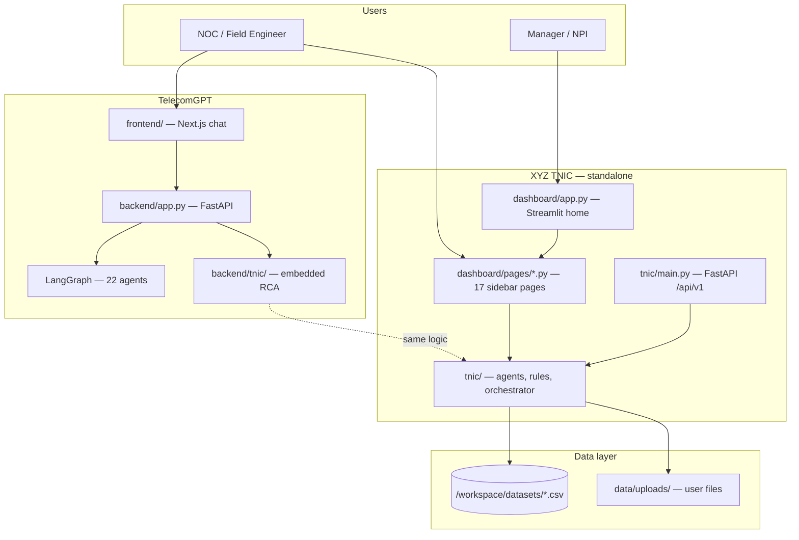
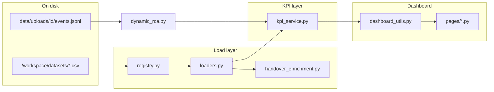
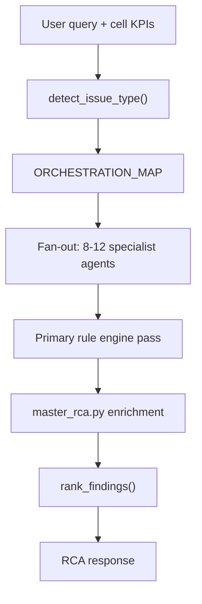

# TelecomGPT & TNIC RCA Dashboard — Full Implementation Overview

Manager and developer reference for how the XYZ Telecom Network Intelligence Copilot (TNIC) RCA dashboard and TelecomGPT platform were implemented.

**Repository:** [github.com/aqil2020in/telecomgpt](https://github.com/aqil2020in/telecomgpt)  
**Demo cells:** XYZ401–XYZ410  
**Related:** [ARCHITECTURE.md](./ARCHITECTURE.md) · [TNIC_DASHBOARD_DATA_FLOW.md](./TNIC_DASHBOARD_DATA_FLOW.md) · [TelecomGPT_TNIC_Implementation_Handout.pdf](./TelecomGPT_TNIC_Implementation_Handout.pdf)

---

## 1. Executive Summary

TelecomGPT is a domain-specific multi-agent AI platform for **5G/LTE RF and network operations**. The monorepo contains **two related products** plus shared analytics tooling:

| Product | Location | Purpose |
|---------|----------|---------|
| **TelecomGPT** | `backend/`, `frontend/` | LangGraph chat + embedded RCA |
| **XYZ TNIC** | `xyz_tnic/` | Standalone RCA API + Streamlit dashboard |
| **Analytics** | `analytics/` | Generic CSV/log charts (optional) |

**Production deployment:**

- Chat UI: Vercel (`telecomgpt.vercel.app`)
- API: Render (`telecomgpt.onrender.com`)
- TNIC Dashboard: Streamlit local/Docker demo (port 8502)

**Design principle:** Analytics and RCA are **rule-based and auditable** (threshold engines, confidence scores). OpenAI is **optional** — used only for narrative reports when an API key is set.

---

## 2. System Architecture



### 2.1 Two copies of the RCA engine

The same RCA engine exists in two places:

| Location | Purpose |
|----------|---------|
| **`xyz_tnic/tnic/`** | Standalone, full product (API + dashboard + tests + Docker) |
| **`backend/tnic/`** | Embedded in TelecomGPT chat via `bridge.py` |

Both share agents, rules, datasets, and the Master RCA Orchestrator. The Streamlit dashboard lives only under `xyz_tnic/`.

### 2.2 `xyz_tnic/` vs `tnic/` folder names

There is **no top-level `tnic/` folder** at the repo root.

| Name | What it is |
|------|------------|
| **`xyz_tnic/`** | Whole TNIC product — dashboard, API, data, tests, Docker |
| **`tnic/`** | Python package **inside** `xyz_tnic` (import `from tnic.rules import ...`) |

```
xyz_tnic/          ← project folder (what you run/deploy)
├── dashboard/     ← Streamlit UI
├── data/          ← CSVs, uploads, chroma
├── scripts/       ← ingest, etc.
├── tests/
└── tnic/          ← Python package
    ├── main.py    ← FastAPI app
    ├── agents/
    ├── rules/
    └── datasets/
```

---

## 3. How the RCA Dashboard Was Created

### 3.1 Technology choice

The dashboard is a **Streamlit multipage app** — no custom frontend framework. Streamlit auto-builds the sidebar from files in a `pages/` folder.

**Entry point:** `xyz_tnic/dashboard/app.py`

### 3.2 How the sidebar works

Streamlit convention:

| File | Sidebar label | Order |
|------|---------------|-------|
| `dashboard/app.py` | **app** (home) | Always first |
| `dashboard/pages/2_Handover.py` | **Handover** | 2 |
| `dashboard/pages/3_RLF.py` | **RLF** | 3 |
| … | … | … |
| `dashboard/pages/17_Upload.py` | **Upload** | 17 |

Numeric prefixes control sort order. **No router code** — adding a page means adding a file under `pages/`.

Global **Focus cell** selectbox (XYZ401–XYZ410) lives in the sidebar on the home page.

### 3.3 Home page composition

| Section | File | Purpose |
|---------|------|---------|
| Executive KPIs | `app.py` | Cluster health, worst cells, charts |
| Data Sources | `data_sources_section.py` | Table: sidebar page → CSV → row count |
| AI RCA Workflow | `rca_workflow_section.py` | Multi-agent workflow, confidence model, deployment roadmap |
| NPI Copilot | `npi_copilot_section.py` | NPI validation narrative + live agent monitor |
| Dataset Simulation | `dataset_simulation_section.py` (embedded in NPI) | Upload/simulate RCA pipeline |

---

## 4. Standard Sidebar Page Pattern

Every domain page follows the **same 3-layer pattern**:

```
CSV on disk
  → loaders.py (cached pandas read)
  → kpi_service.py (merge KPIs per cell)
  → dashboard_utils.py (helpers + run agent)
  → pages/*.py (metrics, charts, agent findings)
```

### 4.1 Shared dashboard core

**File:** `xyz_tnic/dashboard/dashboard_utils.py`

| Function | Role |
|----------|------|
| `cell_kpis(cell_id)` | Merged KPIs from all CSVs |
| `handover_df()`, `rlf_df()`, `vonr_sessions_df()` | Filtered event tables |
| `run_agent(domain, cell_id)` | Runs one specialist agent |
| `run_rca(cell_id)` | Runs full Master RCA Orchestrator |
| `run_all_agents()` | All 12 specialists (Assurance Hub) |

Sets dataset path: `TNIC_DATASETS_DIR` → `/workspace/datasets` when present.

### 4.2 Example: Handover page

**File:** `xyz_tnic/dashboard/pages/2_Handover.py`

1. Load KPIs via `cell_kpis(cell_id)`
2. Load events via `handover_df(cell_id)`
3. Show metrics: HO success, prep fail, Xn fail, event count
4. Charts: failure type, RSRP/SINR scatter, failure stage
5. Table: recent handover events
6. **`run_agent("handover", cell_id)`** → HO Agent findings

**Data source:** `handover_events_enriched.csv`  
**Agent:** `HOAgent` → `rules/ho_rules.py`

### 4.3 Example: VoNR page

**File:** `xyz_tnic/dashboard/pages/10_VoNR.py`

Same pattern: KPIs → session table/charts → **`run_agent("vonr", cell_id)`**

**Data source:** `vonr_sessions.csv`  
**Agent:** `VoNRAgent` → voice/IMS/QoS rules

### 4.4 Exceptions to the standard pattern

| Page | Difference |
|------|------------|
| **RCA Report** | Calls `run_rca()` → full `MasterRCAOrchestrator` |
| **Assurance Hub** | Calls `run_all_agents()` for all 12 specialists |
| **Upload** | API/local ingest pipeline, not preloaded CSVs |
| **RF Coverage / RF Coverage Map** | `RFCoverageAgent` + Plotly/Google Maps geospatial layer |

---

## 5. Complete Sidebar Pages Inventory

| Page | Source file | Primary data | Specialist agent |
|------|-------------|--------------|------------------|
| **app (home)** | `dashboard/app.py` | All CSVs | Explainer sections; optional live RCA in NPI monitor |
| **Handover** | `pages/2_Handover.py` | `handover_events_enriched.csv` | HOAgent |
| **RLF** | `pages/3_RLF.py` | `rlf_events.csv` | RLFAgent |
| **Call Drops** | `pages/4_Call_Drops.py` | `call_drop_events.csv` | CallDropAgent |
| **RACH** | `pages/5_RACH.py` | `rach_events.csv`, PM | RACHAgent |
| **Throughput** | `pages/6_Throughput.py` | `throughput_metrics.csv` | ThroughputAgent |
| **Beamforming** | `pages/7_Beamforming.py` | PM + synthetic beams | BeamformingAgent |
| **RCA Report** | `pages/8_RCA_Report.py` | All merged KPIs | MasterRCAOrchestrator |
| **RF Coverage Map** | `pages/9_RF_Coverage_Map.py` | Geospatial RF CSV | RFCoverageAgent + Google Maps |
| **VoNR** | `pages/10_VoNR.py` | `vonr_sessions.csv` | VoNRAgent |
| **ANR** | `pages/11_ANR.py` | `anr_events.csv`, neighbors | ANRAgent |
| **Config Audit** | `pages/12_Config_Audit.py` | `cell_configuration.csv` | ConfigAuditAgent |
| **gNB Syslog** | `pages/13_gNB_Syslog.py` | `gnb_syslog.csv` | GNBSyslogAgent |
| **Alarm Correlation** | `pages/14_Alarm_Correlation.py` | `alarm_events.csv` | AlarmAgent |
| **Assurance Hub** | `pages/15_Assurance_Hub.py` | All assurance CSVs | All 12 agents |
| **UE Protocol** | `pages/16_UE_Protocol.py` | `ue_protocol_trace.csv` | UEProtocolAgent |
| **Upload** | `pages/17_Upload.py` | User uploads | Dynamic RCA pipeline |
| **RF Coverage** | `pages/RF_Coverage.py` | Geospatial RF CSV | RFCoverageAgent + Plotly |

**Demo cells:** XYZ401–XYZ410 (synthetic, OSS-shaped schema)

---

## 6. Data Flow



### 6.1 Dataset location

| Path | Role |
|------|------|
| `/workspace/datasets/` | Primary preloaded synthetic CSVs (15 files) |
| `xyz_tnic/data/datasets/` | Fallback copy |
| `TNIC_DATASETS_DIR` env | Override path |

### 6.2 Key data layer files

| Layer | File | Role |
|-------|------|------|
| Registry | `tnic/datasets/registry.py` | Maps dataset names → CSV filenames |
| Loaders | `tnic/datasets/loaders.py` | One cached loader per CSV; column normalization |
| KPI merge | `tnic/datasets/kpi_service.py` | `compute_cell_kpis(cell_id)` — single source of truth |
| Handover enrichment | `tnic/datasets/handover_enrichment.py` | RSRP/SINR, failure stage, RCA scenarios |

### 6.3 Two ingestion paths

**Path A — Preloaded (default sidebar pages):**

CSV → loaders → kpi_service → dashboard pages. No database insert at runtime; pandas in-process.

**Path B — User upload:**

File → classifier → normalizer → `data/uploads/<id>/events.jsonl` → `dynamic_rca.py` → Master RCA.

Upload KPIs **merge** with bundled cell KPIs. Upload does **not** replace preloaded CSVs for Handover/RLF unless files are copied into `datasets/`.

**Upload pipeline files:**

- `tnic/services/ingest_pipeline.py`
- `tnic/services/event_repository.py`
- `tnic/services/dynamic_rca.py`
- `tnic/services/events_kpi_bridge.py`

---

## 7. RCA Agent Pipeline

### 7.1 Specialist agents (12+)

**File:** `xyz_tnic/tnic/agents/specialists.py`

Each agent is a thin wrapper over a **deterministic rule engine**:

```
Agent.analyze(kpis, query)
  → rules/*.py (threshold checks)
  → returns: rule_id, probable_cause, confidence, evidence, recommended_actions
```

| Registry key | Agent | Rule module |
|--------------|-------|-------------|
| `handover` | HOAgent | `rules/ho_rules.py` |
| `rlf` | RLFAgent | `rules/rlf_rules.py` |
| `call_drop` | CallDropAgent | `rules/call_drop_rules.py` |
| `throughput` | ThroughputAgent | `rules/throughput_rules.py` |
| `rach` | RACHAgent | `rules/rach_rules.py` |
| `beamforming` | BeamformingAgent | `rules/beamforming_rules.py` |
| `vonr` | VoNRAgent | `rules/vonr_rules.py` |
| `anr` | ANRAgent | `rules/anr_rules.py` |
| `config_audit` | ConfigAuditAgent | `rules/config_audit_rules.py` |
| `gnb_syslog` | GNBSyslogAgent | `rules/gnb_syslog_rules.py` |
| `alarm` | AlarmAgent | `rules/alarm_rules.py` |
| `ue_protocol` | UEProtocolAgent | `rules/ue_rca_rules.py` |
| `rf_coverage` | RFCoverageAgent | geospatial + `coverage_rules.py` |

### 7.2 Master RCA Orchestrator

**File:** `xyz_tnic/tnic/orchestrator/rca_orchestrator.py`



**Orchestration map (examples):**

- `handover` → handover, rlf, pm, latency, transport, anr, gnb_syslog, alarm
- `rlf` → rlf, handover, call_drop, pm, gnb_syslog, alarm, rf_coverage
- `call_drop` → call_drop, rlf, handover, beamforming, core, transport, vonr, …
- `vonr` → vonr, call_drop, core, latency, rf_coverage, config_audit, gnb_syslog

**28 NOC-grade workflows** in `rca_catalog.py`: coverage hole, ping-pong, Xn failure, VoNR drop, etc.

### 7.3 Confidence and conflict resolution

- **+10%** boost for primary-domain findings
- **+15%** boost when drop classifier agrees
- Cross-domain enrichment (e.g., coverage hole → HO + RLF + drops)
- UE trace findings de-weighted when not primary evidence

Documented on the home page in `rca_workflow_section.py`.

### 7.4 Master RCA enrichment

**File:** `xyz_tnic/tnic/orchestrator/master_rca.py`

- Coverage correlation — coverage hole → HO, RLF, drops, RACH, TP, VoNR
- Workflow correlations — call_drop, handover_failure, vonr_5g_sa, cell_outage templates
- Assurance evidence — syslog, CM, FM, UE trace blocks
- Knowledge graph — `orchestrator/knowledge_graph.py`

---

## 8. TelecomGPT Chat Integration

**File:** `backend/tnic/bridge.py`

| Function | Purpose |
|----------|---------|
| `looks_like_tnic_rca_query()` | Keyword gate — routes RCA queries to TNIC |
| `run_tnic_rca()` | Runs `MasterRCAOrchestrator`, returns markdown + trace |
| `_resolve_kpis()` | Merges bundled `/datasets/` KPIs with optional session CSV upload |

**Callers:**

- `backend/telecom_ai/core.py` — fast instant path
- `backend/tnic/fault_agent.py` — LangGraph `fault_analysis` agent
- `backend/app.py` — `POST /api/tnic/rca`

The Streamlit dashboard imports `xyz_tnic/tnic/*` directly; it does not use `bridge.py` by default.

---

## 9. API Layer

**File:** `xyz_tnic/tnic/main.py`

FastAPI with routers under `/api/v1`:

| Router | File | Key endpoints |
|--------|------|---------------|
| Health | `api/routes/health.py` | `/health` |
| Analyze | `api/routes/analyze.py` | `/analyze/rca`, `/health-score/cell`, `/rca/catalog` |
| Coverage | `api/routes/coverage.py` | Geospatial RF analysis |
| Datasets | `api/routes/datasets.py` | `/datasets/summary`, `/datasets/kpis/{cell}` |
| Upload | `api/routes/upload.py` | `/upload`, `/upload/rca` |
| Incidents | `api/routes/incidents.py` | Incident library |

Streamlit pages use **in-process Python** by default. Upload page can call REST via `TNIC_API_URL` with local fallback.

---

## 10. Implementation Layers (Build Order)

| Layer | What was built | Key deliverable |
|-------|----------------|-----------------|
| 1. Data foundation | 15 synthetic CSVs, loaders, KPI merge | `/workspace/datasets/`, `kpi_service.py` |
| 2. Rule engines | Per-domain threshold rules (3GPP-aligned) | `tnic/rules/*.py` |
| 3. Specialist agents | 12+ thin agent wrappers | `tnic/agents/specialists.py` |
| 4. Master orchestrator | Multi-agent fan-out, ranking, enrichment | `rca_orchestrator.py`, `master_rca.py` |
| 5. Streamlit dashboard | Multipage app + shared utils | `dashboard/app.py`, `pages/*.py` |
| 6. Home management sections | RCA workflow, NPI copilot, data sources | `*_section.py` modules |
| 7. Upload pipeline | Classify → normalize → dynamic RCA | `ingest_pipeline.py`, `dynamic_rca.py` |
| 8. TelecomGPT bridge | Chat integration | `backend/tnic/bridge.py` |
| 9. Docs & demos | Manager/operator guides | `docs/DEMO_MANAGER.md`, this document |

---

## 11. Key Design Decisions

1. **CSV-first demo, OSS-shaped structure** — Same schema as real PM/FM/CM exports; swapping data is an adapter change, not a rewrite.

2. **Rule-based RCA core, LLM optional** — Auditable confidence scores, not black-box answers.

3. **Single KPI merge layer** — Every page and the orchestrator use `compute_cell_kpis()` — no hard-coded UI numbers.

4. **Consistent page template** — Metrics + charts + agent findings; predictable demos across 17 pages.

5. **Two products, one engine** — Standalone TNIC (`xyz_tnic/`) + embedded in TelecomGPT chat (`backend/tnic/`).

6. **Upload path is additive** — Demonstrates future OSS integration without breaking demo pages.

7. **Assurance datasets as first-class** — VoNR, ANR, syslog, alarms, UE trace extend mobility RCA into full assurance hub.

8. **Geospatial RF as dedicated domain** — `enhanced_geospatial_rf_dataset.csv` powers Plotly + Google Maps pages and feeds coverage correlation into master RCA.

9. **Caching for demo performance** — Loader `@lru_cache` + `cell_bundle` cache; restart Streamlit after CSV edits.

---

## 12. How to Run & Demo

```bash
cd xyz_tnic
export TNIC_DATASETS_DIR=/workspace/datasets
streamlit run dashboard/app.py --server.port 8502
```

Optional TNIC API (for Upload REST path):

```bash
uvicorn tnic.main:app --host 0.0.0.0 --port 8010
```

### Recommended demo flow for management

1. **Home** — cluster health, data sources table, RCA workflow explainer
2. **Handover** — pick XYZ401, show KPIs + HO Agent findings
3. **VoNR or RLF** — domain-specific RCA
4. **RCA Report** — full multi-agent orchestration with ranked causes
5. **Assurance Hub** — all 12 agents on one cell
6. **Upload / Simulation** — live ingest → classify → Master RCA

---

## 13. Key File Index

| Concern | Path |
|---------|------|
| Dashboard home | `xyz_tnic/dashboard/app.py` |
| All sidebar pages | `xyz_tnic/dashboard/pages/*.py` |
| Shared dashboard logic | `xyz_tnic/dashboard/dashboard_utils.py` |
| Home sections | `rca_workflow_section.py`, `npi_copilot_section.py`, `data_sources_section.py`, `dataset_simulation_section.py` |
| Dataset registry | `xyz_tnic/tnic/datasets/registry.py` |
| CSV loaders | `xyz_tnic/tnic/datasets/loaders.py` |
| KPI merge | `xyz_tnic/tnic/datasets/kpi_service.py` |
| Master orchestrator | `xyz_tnic/tnic/orchestrator/rca_orchestrator.py` |
| Coverage/workflow enrichment | `xyz_tnic/tnic/orchestrator/master_rca.py` |
| 28 RCA workflows | `xyz_tnic/tnic/orchestrator/rca_catalog.py` |
| Specialist agents | `xyz_tnic/tnic/agents/specialists.py` |
| Rule engines | `xyz_tnic/tnic/rules/*.py` |
| Upload + dynamic RCA | `tnic/services/ingest_pipeline.py`, `dynamic_rca.py` |
| FastAPI entry | `xyz_tnic/tnic/main.py` |
| TelecomGPT bridge | `backend/tnic/bridge.py` |
| Demo CSVs | `/workspace/datasets/` |
| Cloud agent commands | `AGENTS.md` |

---

## 14. Related Documentation

| Document | Audience |
|----------|----------|
| [ARCHITECTURE.md](./ARCHITECTURE.md) | Full system architecture |
| [TNIC_DASHBOARD_DATA_FLOW.md](./TNIC_DASHBOARD_DATA_FLOW.md) | Sidebar → CSV → loader flow |
| [RCA_AGENT_END_TO_END_HANDOVER.md](./RCA_AGENT_END_TO_END_HANDOVER.md) | Handover RCA deep dive |
| [DEMO_MANAGER.md](./DEMO_MANAGER.md) | Manager demo script |
| [XYZ Telecom TNIC.pdf](./XYZ%20Telecom%20TNIC.pdf) | Platform overview PDF |
| [TelecomGPT_TNIC_Implementation_Handout.pdf](./TelecomGPT_TNIC_Implementation_Handout.pdf) | 6-page printable handout |

---

## 15. Summary for Management

**TelecomGPT** is a chat AI for telecom engineers; **TNIC** is the RCA copilot with a **Streamlit dashboard** that shows network health and root-cause analysis across 17 domain pages (Handover, RLF, VoNR, etc.).

The dashboard was built using **Streamlit’s multipage convention** (`pages/` folder = sidebar), a **shared data layer** (CSV loaders + KPI merge), and a **multi-agent RCA engine** (12+ rule-based specialists + Master Orchestrator).

Each sidebar page follows the same pattern: **load CSV → show KPIs and charts → run domain agent**. The home page adds management sections (RCA workflow, NPI copilot, data sources). Data is synthetic but OSS-shaped; replacing it with real exports requires loader changes only — the orchestration and confidence model stay the same.
